# Chapter 2 — The Sun: A Garden-Variety Star

## TL;DR

- Why the Most Ordinary Star in the Galaxy Is Trying to Kill Your Power Grid.
- The chapter moves through The Composition Problem, The Energy Problem, The Slowness of Light, Where Things Get Interesting: Convection, and related ideas.
- Read it for the main argument, the vocabulary it introduces, and the practical judgment it asks you to develop.

*Why the Most Ordinary Star in the Galaxy Is Trying to Kill Your Power Grid.*

On the morning of September 1, 1859, an English amateur astronomer named Richard Carrington was drawing sunspots through a projecting telescope when two intensely bright points of white light appeared among the spot group. They flared, moved, and within five minutes faded. He noted it and waited. He did not have to wait long.

About seventeen hours later, something arrived at Earth. It had no weight that any scale could measure. It made no sound. But at telegraph stations across North America and Europe, the instruments began to spark. Some wires became hot enough to burn operators who touched them. And in the night sky — over Hawaii, over Cuba, over Rome — the aurora blazed visible. People woke at two in the morning convinced it was dawn.

What had arrived was a cloud of magnetized plasma, launched from the Sun, that traveled ninety million miles in seventeen hours, compressed Earth's magnetic field like a fist squeezing a balloon, and dumped enough energy into the upper atmosphere to light the sky from pole to nearly equator. The most advanced communication technology of the industrialized world simply stopped working.

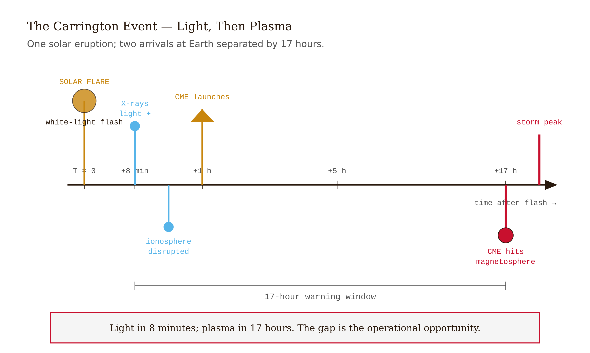
*Figure 2.1 — Sun–Earth timeline for the Carrington Event *

If it happened tomorrow, we would lose power grids, satellites, GPS, hospital equipment, financial networks. The 1859 damage was bounded by the technology of 1859. We have since added considerably more technology. The Sun has not changed.

This is the chapter about why that is possible. Not just *what* the Sun is — though we'll get there — but how the particular machinery inside it leads, by a chain of reasoning that actually makes sense, to the specific fact that charged particles arrive at Earth and set telegraph wires on fire. The Sun is not a lantern hanging in the sky. It is a machine, and once you understand the machine, the violence at the end of the chain is not mysterious at all. It is almost inevitable.

---

## The Composition Problem

For two thousand years the dominant view was that the Sun was composed of something fundamentally different from earthly matter. This was not superstition. It was a reasonable inference: the Sun did not rust, decay, or transform the way terrestrial things did. Aristotle called the heavenly substance the fifth element. The Sun was perfect and eternal. The Earth was base and changeable.

In 1925, a young British astronomer named Cecilia Payne-Gaposchkin decided to read the Sun's composition from its light.

Every element, when heated, absorbs light at specific wavelengths — the same wavelengths it would emit if you excited it in isolation. The pattern is distinctive. Iron has its fingerprint. Hydrogen has its own. Pass sunlight through a prism and spread it into a spectrum, and you see thousands of dark lines where the Sun's cooler outer atmosphere has absorbed specific colors from the light passing through it on its way to your eye. Each dark line is an element saying *I am here*.

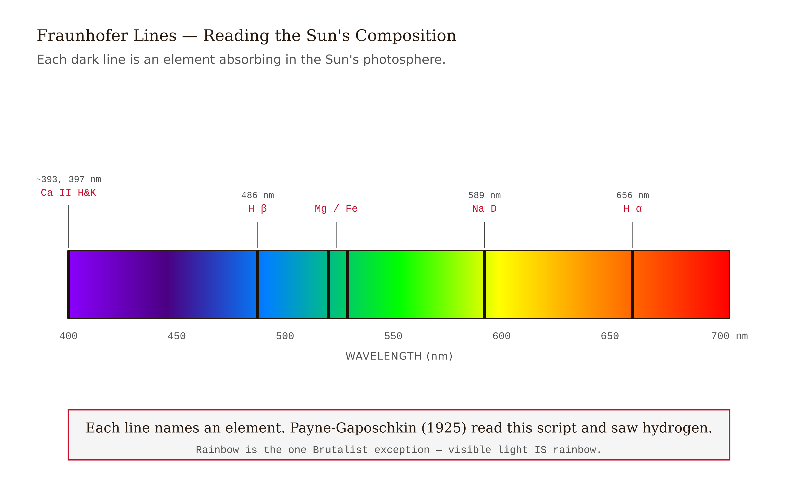
*Figure 2.2 — Solar absorption spectrum (Fraunhofer lines) *

Payne-Gaposchkin measured those lines and ran the calculations. The result was so improbable she doubted herself. The Sun, she found, is approximately 73 percent hydrogen by mass and 25 percent helium. Everything else — carbon, oxygen, nitrogen, iron, all the elements you associate with planets and life — makes up about 2 percent.

She wrote in her doctoral thesis that the enormous abundances she found for hydrogen and helium were "almost certainly not real." Her advisor, Henry Norris Russell, told her to add the disclaimer. He was wrong. She was right. The Sun is made of the two simplest elements in the universe, and almost nothing else.

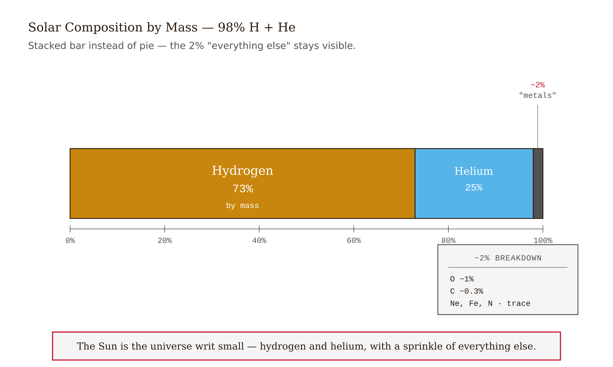
*Figure 2.3 — Pie chart of solar composition by mass *

This matters for what comes next. Hydrogen is not burning in the ordinary chemical sense — there is no oxygen to react with, and chemical burning could not keep the Sun shining for more than a few thousand years. Something else is happening, something that requires 15 million Kelvin to even begin.

---

## The Energy Problem

Here is the problem that stumped physicists for most of the nineteenth century: the Sun is pouring out energy at an enormous rate. The Earth receives about 1,400 watts per square meter at the top of the atmosphere, and the Earth subtends only a tiny fraction of the sphere surrounding the Sun. The total luminosity is staggering — $3.8 \times 10^{26}$ watts. If the Sun were burning coal, it would last about 5,000 years. But the Sun has clearly been shining for billions of years. Coal is not the answer.

The answer is nuclear fusion, and it requires understanding what happens at the core.

At the Sun's center, the temperature reaches 15 million Kelvin. At that temperature, the hydrogen nuclei — bare protons — are moving fast enough that quantum tunneling allows them to approach near enough for the strong nuclear force to take over. Four protons undergo a series of reactions and become one helium-4 nucleus. The helium nucleus has slightly less mass than the four protons that went into it. That missing mass — about 0.7 percent of the original — becomes energy according to $E = mc^2$.

The numbers: the Sun fuses roughly 620 million tons of hydrogen per second. It has been doing this for 4.6 billion years and has used up about half its hydrogen. It will continue for approximately another five billion years. The energy source is real, it is understood, and it is sufficient. The nineteenth-century puzzle is solved.

But solving the energy source raises an immediate second question: how does that energy get from the core to the surface? The Sun is not transparent. The interior is one of the most opaque materials in the solar system, and the story of energy transport through that interior explains, indirectly, nearly everything violent that happens above the surface.

---

## The Slowness of Light

A photon produced in the core of the Sun does not travel outward in a straight line. It travels about one centimeter before it encounters an electron or a nucleus and is scattered in a completely random new direction. One centimeter. The core is so dense — so packed with particles — that light cannot propagate freely. The photon stumbles through the interior in what mathematicians call a random walk: one step, random direction, one step, random direction, over and over.

The statistics of random walks produce a remarkable result. If each step is of length $l$, and the total distance from start to finish is $D$, the number of steps required to travel distance $D$ in a random walk is not $D/l$ but $(D/l)^2$. The straight-line trip from the Sun's core to its surface at light speed takes about two seconds. But a random walk with steps of 1 centimeter across 700,000 kilometers takes roughly $10^{26}$ steps. At the speed of light, that is about 100,000 years.

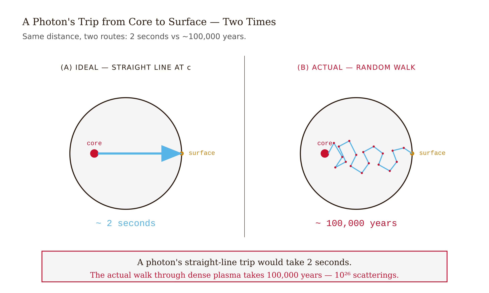
*Figure 2.4 — Random walk vs*

The light hitting your eyes right now left the Sun's surface eight minutes ago. But the energy in that light left the Sun's *core* roughly 100,000 years ago — around the time modern humans were first spreading into Europe.

This zone — the dense, radiation-dominated interior extending from the core to about 70 percent of the Sun's radius — is called the radiative zone. Energy diffuses outward through it the way heat diffuses through a thick wall: slowly, steadily, without anything dramatic happening. Below the surface, the Sun is almost unimaginably boring.

---

## Where Things Get Interesting: Convection

At about 70 percent of the radius outward, the temperature has dropped to around 2 million Kelvin. At that temperature, something changes. The plasma cools enough that electrons can recombine with nuclei — and atoms with electrons absorb radiation far more efficiently than bare nuclei. The plasma becomes so opaque that radiation alone cannot carry the energy outward fast enough. The energy backs up.

When more heat arrives from below than can be transported upward by radiation, the only option is convection. Hot material rises. Cool material sinks. It is the same process that moves warm water to the surface of a heating pot, the same process that drives a thunderstorm, the same process that moves continents — just operating in a shell of plasma 200,000 kilometers deep, at temperatures of millions of Kelvin, cycling material at thousands of meters per second.

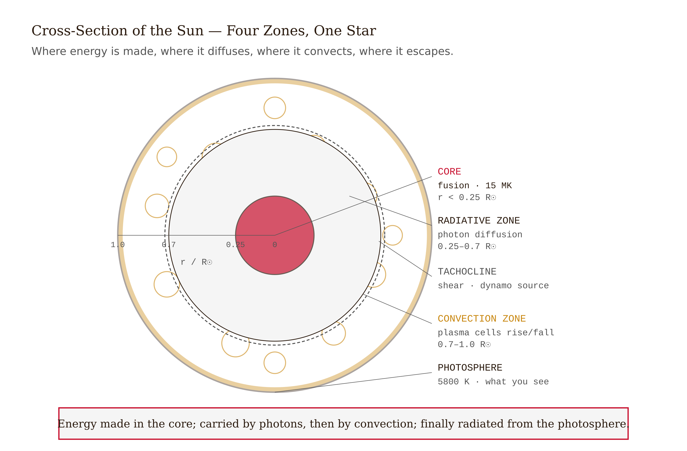
*Figure 2.5 — Labeled cross-section of the Sun's interior *

The tops of these convection cells are visible from Earth. High-resolution solar telescopes show the photosphere — the thin layer where light finally escapes — covered in polygonal bright patches roughly 1,000 kilometers across, called granules, surrounded by darker lanes where cooler plasma is sinking. Each granule rises, spreads, cools, and dissolves in about eight minutes. The photosphere is covered with millions of them at any moment. The Sun's surface is not still. It is churning.

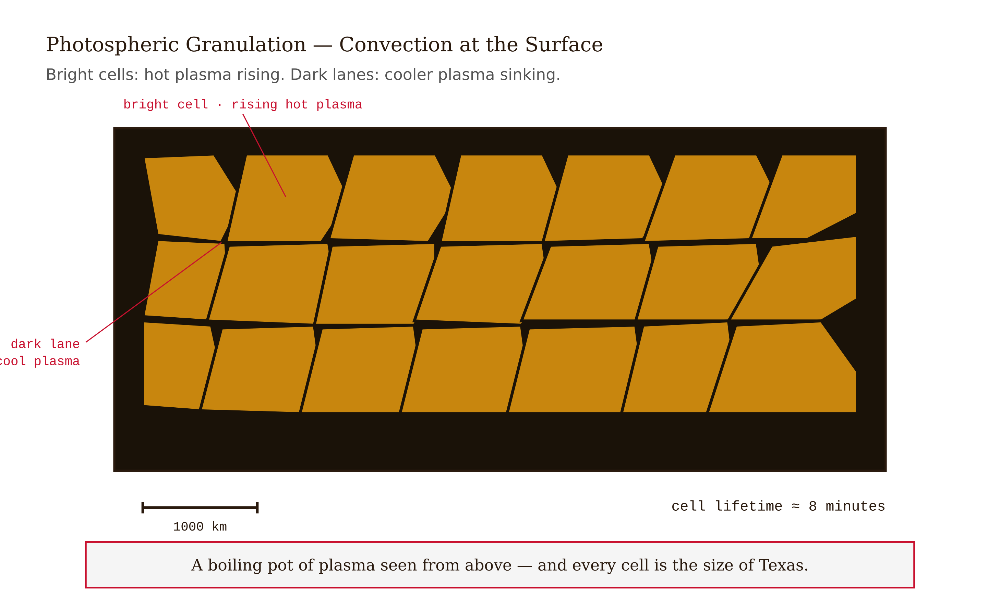
*Figure 2.6 — High-resolution solar telescope photograph of photospheric granulation *

The convection zone is also where the Sun's magnetic field is generated. This is the connection we need.

---

## The Generator

Moving plasma is moving charge. Moving charge generates a magnetic field. The convection zone is an enormous, turbulent, electrically conducting fluid — a natural dynamo. But the specific feature that makes the Sun's magnetic field so complex is differential rotation.

The Sun does not rotate as a rigid body. Its equator rotates faster than its poles — about 25 days per rotation at the equator versus 36 days near the poles. The magnetic field, which is frozen into the conducting plasma, gets stretched and wound by this differential rotation. The equatorial field gets pulled ahead of the polar field. Imagine stirring a very viscous fluid in which thin strands of chocolate have been laid in straight lines north to south — after a few stirs, the strands are wound around and around, increasingly tangled, amplified.

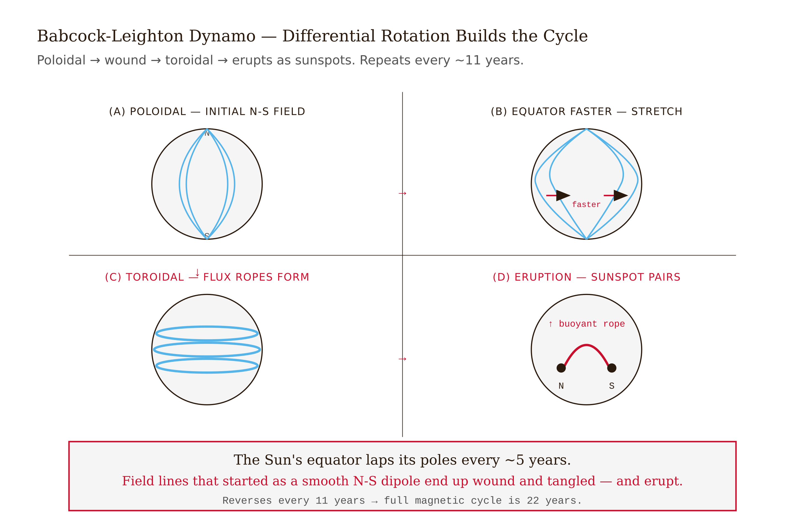
*Figure 2.7 — Differential rotation winding the magnetic field *

After enough windings, the magnetic field is coiled so tightly that it forms concentrated flux tubes. These tubes are so magnetically pressurized that they are less dense than their surroundings. Buoyant, they rise through the convection zone like long magnetic ropes. When one of these ropes punches through the photosphere, it creates a pair of sunspots: one where the field emerges (one magnetic polarity) and one nearby where it re-enters (opposite polarity). The strong field in the tube suppresses convection underneath, blocking the upward heat flow. The region cools to about 3,800 Kelvin — still intensely hot, but cool enough relative to the surrounding 5,800 Kelvin to appear dark.

A sunspot is not a dark spot. It is a place where the Sun's magnetic field is blocking the heat.

---

## The Cycle

The amateur pharmacist Heinrich Schwabe spent seventeen years, starting in the 1820s, looking for a hypothetical planet inside Mercury's orbit. He thought he could find it by watching for its shadow to cross the solar disk. To distinguish such a shadow from ordinary sunspots, he kept meticulous daily counts. He never found the planet. But by 1843 he had enough data to see something no one had noticed before: sunspot activity waxes and wanes on a regular cycle, averaging about eleven years.

The mechanism is the dynamo described above, running to its natural conclusion. The field winds up over roughly five years — sunspot activity rises as flux tubes emerge in growing numbers. Then the field becomes so tangled, so stressed by continued winding, that it breaks apart and reconnects to new configurations. The energy stored in the magnetic field is released. The field rebuilds, but with reversed polarity. What was north is now south. The cycle repeats, taking another eleven years to reverse again — meaning the true magnetic cycle is 22 years, though the observable sunspot cycle is 11.

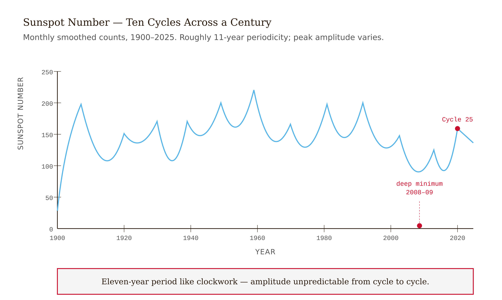
*Figure 2.8 — Monthly smoothed sunspot number vs*

Right now, we are in Solar Cycle 25, approaching maximum. The Sun will be most active around 2025 and decline thereafter. We know this in the same way we know when the tide will come in: the broad pattern is regular enough to predict. What we cannot predict is which specific active region will produce a major flare on which specific day. The cycle is the rhythm. The individual events are the improvisation.

---

## What Happens Above the Surface

Above the photosphere, the Sun's atmosphere does something that violates every naive expectation. Temperature should fall as you move away from the heat source. For a few hundred kilometers above the photosphere, it does — reaching a minimum of about 4,400 Kelvin at roughly 500 kilometers altitude. Then it rises. By 2,000 kilometers up, in the region called the chromosphere, it reaches 10,000 Kelvin. And in the outermost atmosphere — the corona, visible as the pearly halo during a total solar eclipse — the temperature climbs to between one and three million Kelvin.

You are moving away from the most powerful energy source in the solar system, and the temperature rises by a factor of nearly 200.

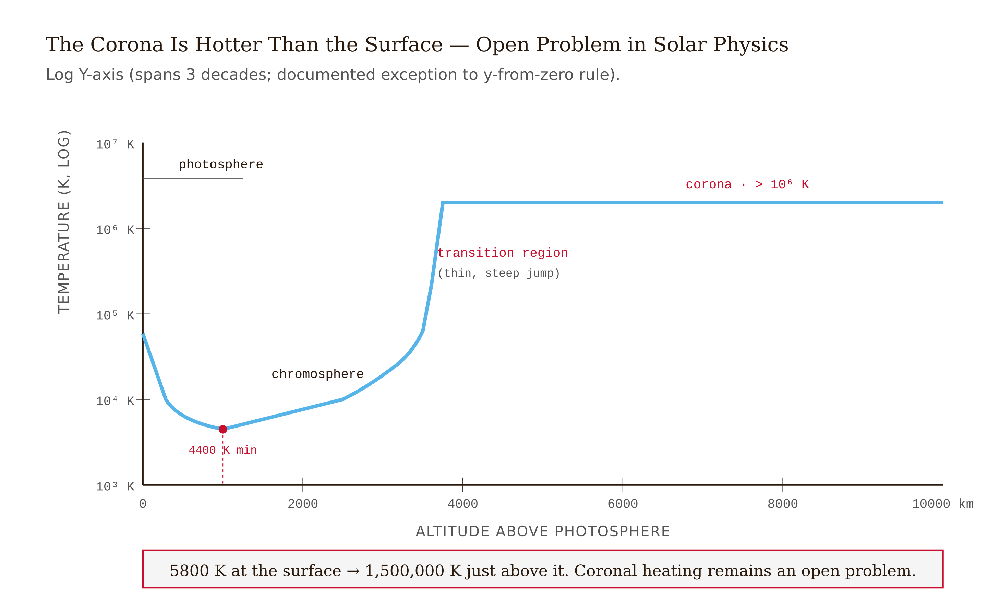
*Figure 2.9 — Temperature vs*

This is not a trick of measurement. It is real. And it is one of the major unsolved problems in astrophysics. We know the magnetic field is involved — waves and oscillations propagating upward from the convection zone carry energy into the corona, and magnetic reconnection events release energy there — but the precise mechanism by which the corona maintains temperatures of a million Kelvin remains genuinely open. The corona is simultaneously the most visible and the least understood part of the Sun.

What the corona's temperature does, regardless of how it is maintained, is allow plasma to escape. The corona is so hot that its thermal energy exceeds the Sun's gravitational pull at the corona's outer boundary. Plasma evaporates continuously into interplanetary space: a constant outflow of protons and electrons streaming away from the Sun at roughly 400 kilometers per second. This is the solar wind. It has been blowing for 4.5 billion years. It shaped Earth's magnetosphere. It carved the magnetotails of every planet in the solar system.

---

## The Two Things That Can Hurt You

Sunspot maximum is when the tangled magnetic field above active regions is under the most stress. Two distinct events can result.

The first is a solar flare. When two magnetic loops with opposite orientations approach each other in the corona, the field lines break and reconnect explosively. The stored magnetic energy — which had been building since those loops were first dragged up through the photosphere — releases all at once. The surrounding plasma is heated to tens of millions of Kelvin. A flood of X-rays and extreme ultraviolet radiation streams outward. Because it travels at the speed of light, it arrives at Earth eight minutes after the flare. There is no warning time. By the time anyone knows it happened, it has already arrived. The X-rays ionize the upper atmosphere, disrupting the ionosphere that radio communication depends on as a reflector. Satellites experience increased drag as the upper atmosphere expands from sudden heating.

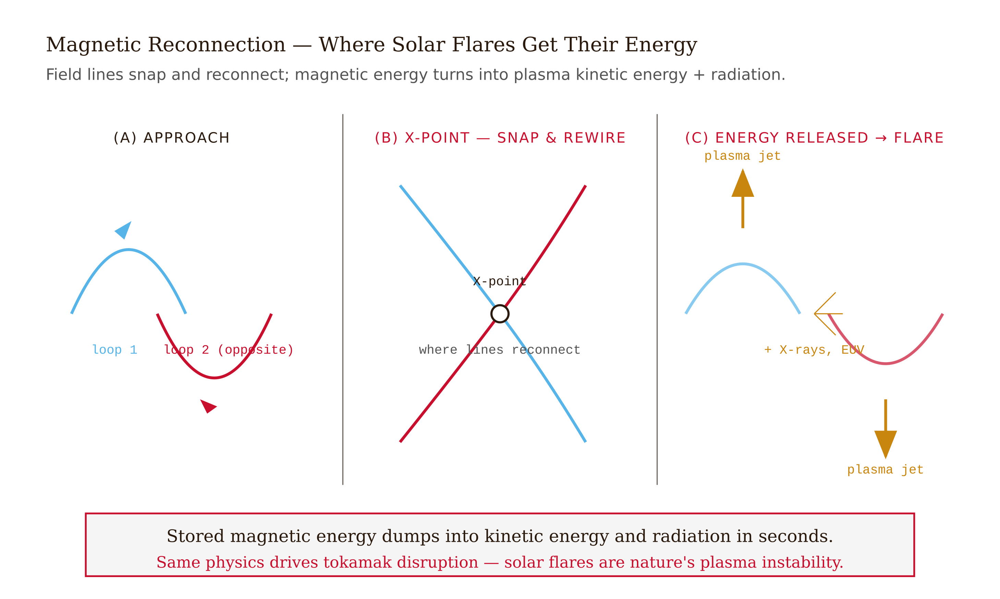
*Figure 2.10 — Magnetic reconnection sequence *

The second event is a coronal mass ejection. Sometimes — not always, and not only with flares — the eruption launches an actual cloud of plasma: tens of millions of tons of magnetized material blasted away from the corona at 500 to 1,000 kilometers per second. A CME is not radiation. It is matter. It does not travel at the speed of light. It arrives at Earth in two to four days. Unlike the flare's instantaneous punch, a CME is a slow punch you can see coming — and modern solar observatories do see them coming, giving a few days of warning.

When a CME arrives, it encounters Earth's magnetic field. The outcome depends critically on the orientation of the CME's own magnetic field. If the CME's field happens to point southward — opposite to Earth's equatorial field, which points northward — the two fields connect. Charged particles funnel deep into the magnetosphere along field lines that now extend from the CME all the way down to Earth's polar regions. The field compressions and oscillations induce electric currents in anything long and conducting at the surface: power lines, pipelines, telegraph wires.

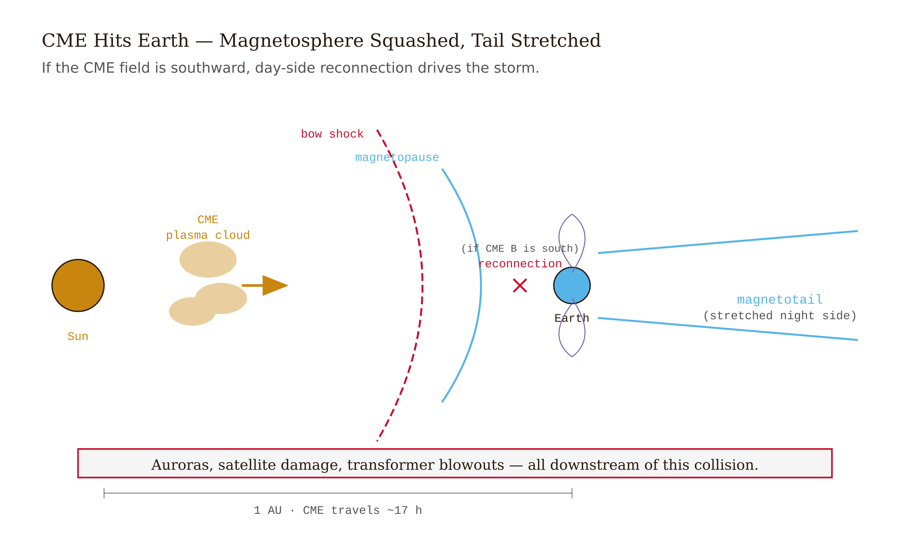
*Figure 2.11 — Earth's magnetosphere during CME impact *

This is exactly what happened in 1859. This is what burned Carrington's telegraph operators.

---

## The Near Miss You Probably Didn't Hear About

In July 2012, a CME of Carrington-class intensity erupted from the Sun. It was a large event — comparable in energy to the 1859 storm by most measures. It missed Earth. The Earth happened to be elsewhere in its orbit; the CME passed through the region of space Earth had occupied about a week earlier.

Studies published afterward, using satellite data from the STEREO spacecraft that did catch the CME directly, estimated that if it had struck Earth, the damage to infrastructure in the United States alone would have been between one and two trillion dollars, with recovery taking years. High-voltage transformers are particularly difficult to replace — they are custom-built, not mass-produced, and there are not many spare ones.

This is not a hypothetical projection about a possible future event. It is a description of something that already happened, in 2012, and missed.

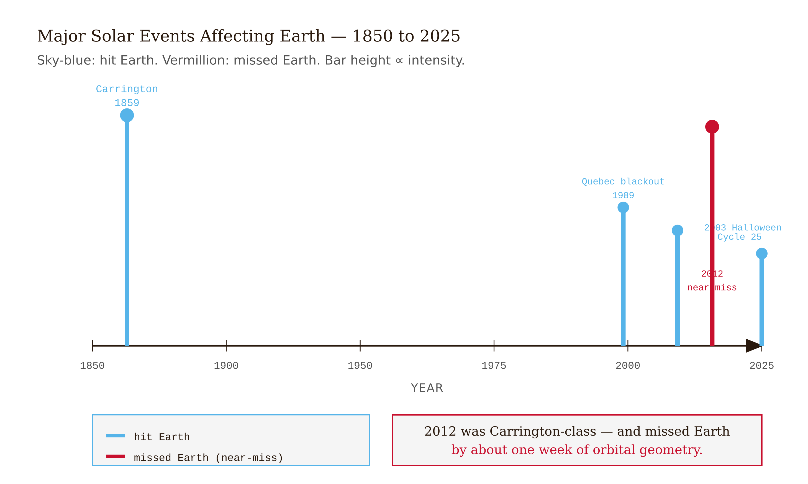
*Figure 2.12 — Major solar events and Earth impacts on a*

The Carrington Event of 1859 happened. The 1989 Quebec blackout — a much weaker storm that knocked out power for six million people for nine hours in a Canadian winter — happened. The 2003 Halloween storms damaged or destroyed several satellites. The 2012 near-miss happened.

The Sun's behavior has not changed. Our dependence on the technologies the Sun can disrupt has increased continuously since 1859. The machine is the same machine. Only our exposure to it has grown.

---

## What the Sun Is, in the End

The Sun is a G2V main-sequence star. G means its surface temperature is between about 5,200 and 6,000 Kelvin. V means it is fusing hydrogen in its core, like most stars for most of their lives. There are billions of stars like it in the Milky Way. By every stellar measure, it is aggressively ordinary.

It formed 4.6 billion years ago from a collapsing cloud of gas and dust — itself the remnant of earlier generations of stars that had lived, fused heavier elements in their cores, and scattered those elements back into the interstellar medium when they died. The iron in your blood was manufactured in the core of a star that exploded billions of years before the Sun existed. We are made of ash.

The Sun will continue fusing hydrogen for another five billion years or so. As it ages, its luminosity will gradually increase — it is already about 30 percent brighter than it was when Earth formed, a change with real consequences for Earth's climate history. When the hydrogen in the core is finally exhausted, the core will contract, the outer layers will expand enormously, and the Sun will become a red giant: vastly larger, cooler at the surface, likely engulfing Mercury and Venus and possibly Earth. The outer layers will be expelled as a planetary nebula. The remaining core will become a white dwarf — roughly Earth-sized, slowly cooling over billions of years in the dark.

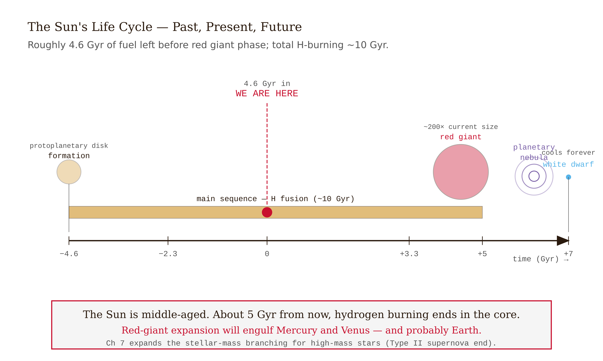
*Figure 2.13 — Sun's life cycle on a horizontal timeline *

None of that matters on any human timescale. What matters to us is the eleven-year cycle, the coronal mass ejections, the solar flares, the charged particles that reach Earth in days. The Sun is stable enough, on billion-year scales, for life to evolve and persist. It is violent enough, on eleven-year scales, to periodically threaten the infrastructure that life — in its current technological form — depends on.

Cecilia Payne-Gaposchkin read the Sun's spectrum in 1925 and found that it was mostly hydrogen and helium. She doubted herself. Her advisor told her the result was probably wrong. She published it with a disclaimer walking back her own finding. She was right. The universe is not built to match our expectations. Our job is to read what is actually there.

---

## LLM Exercises

**Exercise 1.** The Sun's surface temperature is approximately 5,800 K, but its corona reaches temperatures of 1–3 million K. Prompt an LLM: *"Why is the corona so much hotter than the surface below it? This is the 'coronal heating problem' — one of the long-standing puzzles in solar physics. Walk through the leading hypotheses: magnetic-field reconnection events releasing stored energy, and Alfvén wave dissipation depositing wave energy as heat. Why is this such a difficult problem to solve definitively?"* Evaluate whether the response correctly identifies that the photosphere-to-corona temperature increase violates ordinary thermodynamic intuition (energy should not flow from cooler to hotter), requiring a non-thermal energy transport mechanism — most likely magnetic.

**Exercise 2.** The Sun's photosphere shows a granulation pattern — convection cells about 1,000 km across that bring hot gas up from below. Prompt an LLM: *"What does the granulation pattern reveal about the Sun's interior? Specifically, why does the convection zone extend through approximately the outer 30% of the Sun's radius, while the inner core transports energy by radiation rather than convection?"* Evaluate whether the response correctly identifies that convection vs. radiation is determined by the temperature gradient and opacity: where opacity is high enough that radiation cannot carry the heat outward, convection takes over.

**Exercise 3.** Sunspots appear darker than the surrounding photosphere because they are cooler — about 4,000 K vs. 5,800 K. Prompt an LLM: *"Why are sunspots cooler? Walk through the magnetic-field explanation: strong magnetic fields suppress convection, blocking the upward transport of heat from the interior. Sunspots appear in pairs of opposite magnetic polarity. What is the 11-year cycle of sunspot activity, and what does it tell us about the Sun's magnetic field?"* Evaluate whether the response correctly identifies the convective-suppression mechanism and engages with the cyclical nature of solar magnetic activity.

**Exercise 4.** The Sun's spectrum at the surface contains thousands of dark absorption lines (Fraunhofer lines). Prompt an LLM: *"How do these absorption lines give us specific information about the Sun's composition, despite our never having directly sampled solar material? Walk through Kirchhoff's laws of spectroscopy: hot dense gas emits a continuous spectrum; cool gas in front of a hot source produces dark absorption lines at specific wavelengths; each element produces a unique pattern."* Evaluate whether the response correctly identifies that the Sun's atmosphere absorbs at specific wavelengths corresponding to atomic transitions in elements present, and that this reveals the Sun's composition (mostly hydrogen, helium, plus heavier elements at less than 2%).

**Exercise 5 (challenge).** Solar flares and coronal mass ejections can disrupt Earth-based technology — the 1989 CME caused a province-wide blackout in Quebec; the Carrington Event of 1859 produced auroras visible at the equator. Prompt an LLM: *"Walk me through how a CME interacts with Earth's magnetosphere. Why do these events affect satellites, power grids, and GPS systems? Then estimate: if a Carrington-level event hit Earth today, what would be the economic and societal cost?"* Evaluate whether the response engages with the magnetic induction mechanism (rapidly varying magnetic fields induce currents in long conductors like power lines), the geographic specificity (high-latitude grids most vulnerable), and acknowledges the substantial uncertainty in cost estimates (often quoted at $1–2 trillion globally for a major event, but with wide confidence intervals).
