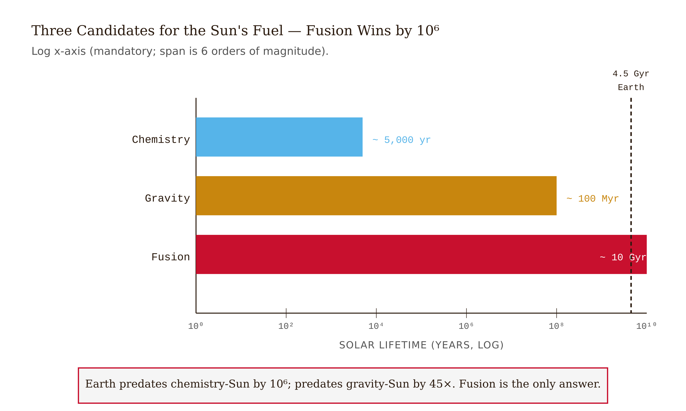
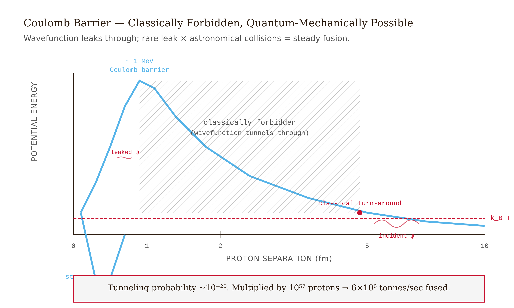
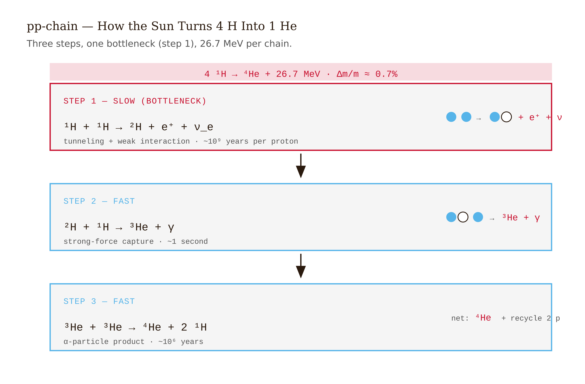
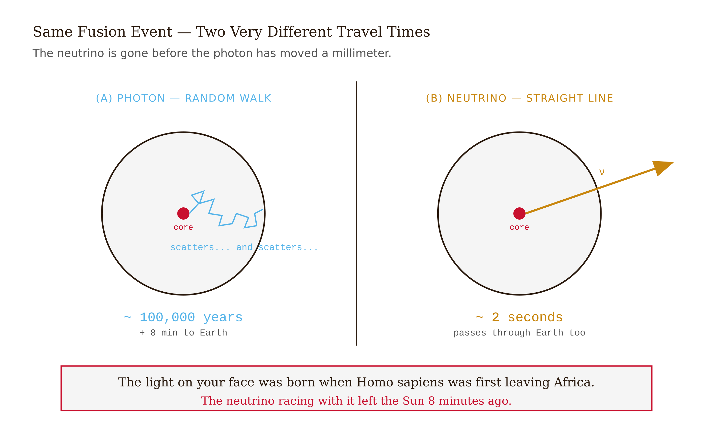
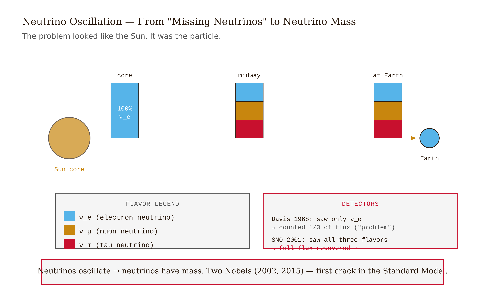
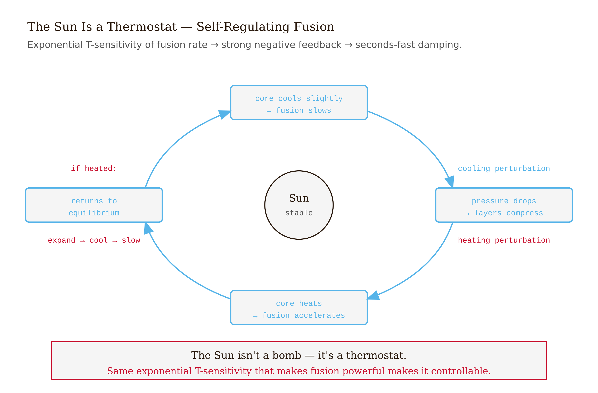

# Chapter 3 — The Sun Burning: Why Four Billion Years of Light Comes from Turning Mass into Energy


## TL;DR

- Charles Darwin died worried about physics.
- The chapter moves through Why Every Obvious Answer Fails, The Barrier That Should Make It Impossible, Four Protons In, One Helium Out, A Million Years Just to Get Out, and related ideas.
- Read it for the main argument, the vocabulary it introduces, and the practical judgment it asks you to develop.

---

Charles Darwin died worried about physics.

He had won nearly every argument about evolution — the religious objections, the gaps in the fossil record, the question of inheritance. But one challenge he could not answer came not from theology but from thermodynamics, and it was delivered by serious men with serious calculations. William Thomson and Hermann von Helmholtz had worked out how long the Sun could possibly shine. Their answer was about 100 million years. Darwin needed hundreds of millions, probably more. The rocks demanded it. The diversity of life demanded it. Natural selection, operating on organisms generation by generation, simply cannot produce what we observe in 100 million years.

Darwin wrote about this problem in letters. He returned to it and never resolved it. He was right to be troubled. The conflict was genuine. The physicists had the right method and the wrong energy source, and they could not have known it, because the correct energy source required two discoveries — the internal structure of the atom and the equivalence of mass and energy — that came after Darwin was dead.

The resolution of his worry is one of the most satisfying stories in all of physics.

---

## Why Every Obvious Answer Fails

Start with the obvious idea: the Sun burns. Like coal.

Coal — carbon combining with oxygen — releases a known amount of energy per kilogram. The Sun radiates at $4 \times 10^{26}$ watts. Work backwards: how much coal would need to burn every second to sustain that output? Roughly 100 million tons per second. Now assume the entire Sun is coal and calculate how long it lasts. About 5,000 years.

We know from geological evidence that liquid water flowed on Earth's surface 4 billion years ago. Chemical burning is off by a factor of nearly a million.

Thomson and Helmholtz had a better idea. Gravity. The Sun's outer layers, falling inward under their own weight, convert gravitational potential energy to heat. Matter falling is accelerated; when it strikes the layers below, the kinetic energy becomes thermal energy. Calculate the total energy available by contracting the Sun from a diffuse gas cloud down to its present size and you get roughly $10^{42}$ joules. At the Sun's current luminosity, that lasts about 100 million years.

This is a real mechanism. Young stars actually use it — before their cores grow hot enough to ignite nuclear fusion, gravitational contraction is what makes them shine. But for the Sun as it is, it gives the wrong answer by more than a factor of forty.

The correct answer sits inside the nucleus of the hydrogen atom, in a place Darwin's physics had no access to. Atoms have cores — tiny, dense nuclei made of protons and neutrons, bound together by a force that operates only at nuclear distances and is far stronger than electricity. Those nuclei carry an enormous amount of energy in the arrangement of their constituents. And mass, it turns out, is not a fixed property of matter. It can be converted into energy, and the conversion rate is $c^2$ — the square of 300,000 kilometers per second — which is a very large number.

If the Sun can fuse lightweight nuclei into slightly heavier ones, and if the product weighs slightly less than the ingredients, then that missing mass has become energy. Not released from a chemical bond. Not extracted from a gravitational fall. Annihilated, and replaced by radiation.

This is what the Sun is doing. It is not burning. It is converting mass into light.

---

## The Barrier That Should Make It Impossible

To fuse two hydrogen nuclei, you have to bring two protons together. Protons are positively charged, and like charges repel. The closer they approach, the stronger the repulsion. This is the Coulomb barrier, and it is steep.

For the strong nuclear force to grab two protons and hold them together, they must close to within about $10^{-15}$ meters — the scale of a nucleus. To reach that distance against electrical repulsion, a proton needs to be moving at roughly 1,000 kilometers per second. At the Sun's core temperature of 15 million Kelvin, the average proton moves at about 500 kilometers per second.

By the physics of Newton and Maxwell, fusion in the Sun is essentially impossible. The Sun should be cold and dark.

The resolution is quantum mechanics. At the scale of atomic nuclei, particles do not behave like billiard balls. They behave like waves, and a wave has a property that a ball does not: it can partially penetrate a barrier rather than stopping cleanly at it. A proton approaching another proton is not a projectile hitting a wall — it is a probability distribution, a wave function with a small but nonzero amplitude on the other side of the barrier. The proton does not go over the barrier. It appears, with some probability, on the far side. This is quantum tunneling.

The probability is small. For a proton moving at the average thermal speed in the solar core, the chance of tunneling through the Coulomb barrier in any given collision is extraordinarily low. A proton bounces off other protons billions of times per day, and it will do this for a very long time before it finally tunnels through and fuses. The average wait for a given proton is on the order of 14 billion years — longer than the current age of the universe.

This seems to make the problem worse. If each proton has to wait billions of years, how does the Sun shine at all?

The answer is the number of protons. The Sun's core contains roughly $10^{57}$ protons — more than the number of stars in the observable universe. Every second, an unimaginable number of proton-proton collisions occur. Even though the probability of fusion in any single collision is almost nothing, multiplying almost nothing by $10^{57}$ gives a fusion rate that matches what we observe. The improbable happens constantly, in aggregate.

The Sun shines because it is large enough for rare events to become routine.

---

## Four Protons In, One Helium Out

The conversion happens in three steps, and knowing the steps matters because the bottleneck reveals something important.

The first step is the hardest. Two protons collide, and one of them undergoes a transformation: the weak nuclear force converts a proton into a neutron, emitting a positron and a neutrino. What remains is deuterium — one proton, one neutron, bound together. The positron immediately meets a nearby electron and annihilates, producing gamma rays. The neutrino, interacting with almost nothing, escapes the Sun directly. It will reach Earth in about eight minutes.

$$^1\text{H} + {^1\text{H}} \longrightarrow {^2\text{H}} + e^+ + \nu$$

This step is the rate-limiting bottleneck of the entire chain. It requires not only quantum tunneling but also the weak force — which is weak by definition. Each proton waits billions of years for this step, not because tunneling is impossible, but because the weak force conversion is itself rare. This is the step that regulates everything else.

The second step is fast by comparison. The newly formed deuterium nucleus almost immediately — within seconds, typically — collides with another proton and absorbs it, producing helium-3: two protons and one neutron. A gamma-ray photon is released.

$$^2\text{H} + {^1\text{H}} \longrightarrow {^3\text{He}} + \gamma$$

The third step pairs two helium-3 nuclei. They fuse into helium-4 and release two protons back into the plasma. These protons rejoin the pool and eventually go through the whole chain again.

$$^3\text{He} + {^3\text{He}} \longrightarrow {^4\text{He}} + {^1\text{H}} + {^1\text{H}}$$

Net result: four hydrogen nuclei in, one helium-4 nucleus out.

Now do the accounting. Four protons have a combined mass of $4 \times 1.007276 = 4.02910$ atomic mass units. One helium-4 nucleus has a mass of $4.00150$ atomic mass units. The difference is $0.02760$ atomic mass units — about 0.7% of the starting mass.

That 0.7% has ceased to exist as mass. It has become energy.

Apply $E = mc^2$ to the scale of the Sun. The Sun radiates $4 \times 10^{26}$ watts. The mass that must disappear per second to sustain that output:

$$\dot{m} = \frac{P}{c^2} = \frac{4 \times 10^{26}}{(3 \times 10^8)^2} \approx 4.4 \times 10^9 \text{ kg/s}$$

About 4 million metric tons of matter vanish every second. Every second, for 4.5 billion years, and counting.

Yet the Sun's total mass is $2 \times 10^{30}$ kilograms. Losing 4 million tons per second, the Sun would take roughly 15 billion years to exhaust even 1% of its mass. Darwin needed hundreds of millions of years. The Sun can give 10 billion. The problem that stopped him has been solved — overshot by a large margin, in a way no one in his time could have foreseen.

---

## A Million Years Just to Get Out

A gamma-ray photon born in the solar core has a long journey ahead of it.

It does not travel directly to the surface. It cannot. The interior of the Sun is a dense, hot plasma — electrons and ions moving fast, packed close together. A photon born in the core travels on average about one centimeter before it strikes an electron and is absorbed. It is then reemitted — but in a completely random direction. Up, down, sideways, diagonally. No preference. No memory of where it came from.

This is a random walk. Each step is about one centimeter. The distance from the core to the surface is 700,000 kilometers — $7 \times 10^{10}$ centimeters. In a random walk, the expected number of steps to cover a net distance $d$ using steps of length $\ell$ is $(d/\ell)^2$. That is $(7 \times 10^{10})^2 \approx 5 \times 10^{21}$ steps.

Traveling at $c$, covering $5 \times 10^{21}$ centimeters takes somewhere between 100,000 and 1,000,000 years.

The photon landing on your face right now was created in a fusion reaction that occurred before multicellular life existed on Earth. It spent nearly its entire existence trapped in the solar plasma, bouncing in random directions, slowly drifting outward. The last eight minutes of its journey — vacuum, empty space, nothing — were the only time it moved freely.

Neutrinos tell a completely different story. They are produced in the same fusion reactions, carrying the same information about conditions in the solar core. But they interact only through the weak nuclear force, which means ordinary matter is essentially transparent to them. A neutrino born in the solar core passes through the entire bulk of the Sun as though it were empty. Then through Earth. It is here in about two seconds.

The million-year photon and the two-second neutrino came from the same event. One was trapped in a plasma for geological timescales. The other was already gone before the photon had traveled a millimeter.

---

## The Tank of Cleaning Fluid

In 1970, Raymond Davis Jr. lowered a tank containing 400,000 liters of perchloroethylene — industrial cleaning fluid — 1.5 kilometers into a gold mine in South Dakota. The depth was essential: cosmic rays striking the atmosphere create a constant rain of particles, and underground, that rain is blocked. Only neutrinos, passing through rock as easily as through air, could reach the detector.

The idea was that solar neutrinos would occasionally strike a chlorine nucleus in the cleaning fluid and convert it to a radioactive isotope of argon. Davis would purge the argon out of the tank periodically and count the radioactive atoms. Theory predicted about one argon atom per day.

He counted, and counted, for years. The result was consistent and disturbing: roughly one-third the predicted number of neutrinos were appearing.

Not a small discrepancy. One-third is a large fraction to be missing. Two explanations competed. Either the solar model was wrong — the Sun's core was cooler or less dense than calculated, and fusion was proceeding more slowly — or something was happening to the neutrinos themselves during the eight-minute journey from the Sun to Earth.

The solar model was tested independently by helioseismology: measuring acoustic oscillations propagating through the Sun's interior, which constrain the temperature and density at every depth with remarkable precision. The model was correct. Fusion was happening at exactly the predicted rate. The neutrinos were being produced in the right numbers.

They were changing on the way.

The Sudbury Neutrino Observatory in Canada, built in the 1990s two kilometers underground in a nickel mine, used a different detector: heavy water. The crucial difference was that Sudbury could detect all three types of neutrinos — electron, muon, and tau — while Davis's chlorine detector was sensitive only to electron neutrinos.

Sudbury's measurement: the total number of neutrinos arriving from the Sun matched the solar model prediction almost exactly. But only one-third were electron neutrinos. The other two-thirds had become muon and tau neutrinos during the transit.

The electron neutrinos were not disappearing. They were changing type.

This transformation is called neutrino oscillation, and it can only occur if neutrinos have mass. A massless particle travels at exactly the speed of light and cannot oscillate between types. The fact that solar neutrinos arrive in a different flavor mixture than they were born with is direct evidence that they have mass — some small but nonzero value. This was not predicted by the standard model of particle physics. The solar neutrino problem, which looked like a problem with the Sun, turned out to be a discovery about a fundamental property of matter.

Davis and Masatoshi Koshiba, whose work confirmed the picture with atmospheric neutrinos, shared the 2002 Nobel Prize in Physics. Takaaki Kajita and Arthur McDonald, whose experiments at Sudbury and Super-Kamiokande confirmed oscillation definitively, shared the 2015 Nobel. The problem ran for thirty years and ended with two Nobel Prizes and a new property of the universe.

The Sun was correctly understood the whole time. The particle was not.

---

## Why the Sun Does Not Explode

There is something worth pausing on. The fusion rate at the Sun's core depends exponentially on temperature. Higher temperature means higher collision energies, which means exponentially better tunneling probabilities. A small increase in core temperature produces a dramatically larger fusion rate. A star might seem to be a bomb waiting to go off.

It is not. It is a thermostat.

At every depth inside the Sun, the outward pressure of hot gas is balanced by the weight of all the gas above it. This is hydrostatic equilibrium. The fusion energy at the core is what maintains the temperature that maintains the pressure that maintains the balance.

Now suppose something perturbs the core — cools it slightly. Fusion slows. Pressure drops. The overlying layers compress inward under gravity. The core heats up. Fusion accelerates. Pressure is restored. The perturbation is damped.

The feedback works in the other direction too. If fusion speeds up, the extra pressure pushes the overlying layers outward. The core expands, the temperature drops, fusion slows, and equilibrium is restored.

The Sun is self-correcting in both directions. This is why it has burned steadily for 4.5 billion years rather than fluctuating wildly or exploding. The same exponential sensitivity to temperature that makes fusion powerful is what makes it controllable: a thermostat works best when the response to a perturbation is large.

Life on Earth had 4.5 billion years of roughly constant sunlight. It was not a coincidence or good luck. It was a consequence of the physics of hydrostatic equilibrium and the feedback properties of a self-gravitating ball of plasma.

The Sun will continue in this state for another 5 billion years or so, until the hydrogen in its core runs low enough that the structure can no longer maintain the balance. Then it will change into something else. But that is a later story.

What matters here is the mechanism. Four protons enter, one helium nucleus exits, 0.7% of the mass becomes radiation, the radiation spends up to a million years bouncing through dense plasma, and then eight minutes in the clear, and then it is here — in the plants, in the oceans, in the fossil fuels Darwin's physics burned to try to date the Earth, in the light that fell on Darwin himself and on the Galapagos finches he studied. All of it comes from the same conversion, operating at the same rate, regulated by the same thermostat, confirmed by a tank of cleaning fluid in a hole in South Dakota.

Darwin was right to worry. The answer was better than he could have imagined.

---

## LLM Exercises

**Exercise 1.** The proton-proton chain converts four hydrogen nuclei into one helium nucleus, with a mass deficit of about 0.7%. Prompt an LLM: "Where does the missing 0.7% of mass go, and how does Einstein's equation E = mc² explain it? What form does the energy take when it is first released, and what form does it eventually take when it reaches Earth?" Evaluate whether the response correctly traces the energy from nuclear binding energy release → gamma rays → photon random walk → eventual visible light at the surface, and whether it correctly explains that mass is not simply "lost" but converted.

**Exercise 2.** A single proton in the Sun's core waits, on average, billions of years before fusing — yet the Sun fuses about $6 \times 10^{11}$ kg of hydrogen per second. Prompt an LLM: "How can both of these facts be true simultaneously? What does this tell you about the relationship between probability and scale?" Evaluate whether the response correctly identifies that $10^{57}$ protons × tiny probability per proton × enormous collision rate per second = substantial fusion rate — and whether it draws the general lesson about rare events at large numbers.

**Exercise 3.** Quantum tunneling allows protons to fuse at temperatures far below what classical physics would require. Prompt an LLM: "If the Sun's core temperature were doubled, would the fusion rate increase, decrease, or stay the same? Explain the mechanism." The answer is: the rate increases dramatically, because tunneling probability depends exponentially on the ratio of collision energy to barrier height. Higher temperature means higher collision energy, which means the wave function penetrates the barrier more deeply. Evaluate whether the LLM correctly identifies the exponential sensitivity, or whether it gives a vague answer about "more collisions."

**Exercise 4.** Raymond Davis Jr.'s experiment detected only one-third the predicted number of solar neutrinos. For decades, this was called the solar neutrino problem. Prompt an LLM: "What were the two possible explanations for the missing neutrinos? What evidence distinguished between them, and which turned out to be correct?" Evaluate whether the response correctly identifies (1) the solar model might be wrong, and (2) something happens to neutrinos in transit — and whether it correctly states that helioseismology ruled out option 1, and the Sudbury result confirmed option 2.

**Exercise 5 (challenge).** Gravitational contraction and nuclear fusion are both real energy sources for stars. Prompt an LLM: "For a star just forming — a protostar still contracting from a cloud of gas — which energy source dominates, and why? At what point does nuclear fusion take over, and what determines that transition?" Then ask: "If a forming star has too little mass, fusion never ignites. What is the minimum mass required, and what happens to objects below that threshold?" Evaluate whether the response correctly identifies the Kelvin-Helmholtz mechanism for young stars, the ignition condition for hydrogen fusion (core temperature ~10 million K), and the nature of brown dwarfs as the sub-ignition objects.

---

##  AI Wayback Machine
The ideas in this chapter didn't appear from nowhere. **Hans Bethe** worked out the nuclear reactions that power the Sun in 1939 — the proton-proton chain and the CNO cycle — earning the 1967 Nobel Prize. He was a German Jewish physicist who escaped Nazi Germany and later led the theoretical division at Los Alamos.

**Run this:**

```
Who was Hans Bethe, and how does his work on stellar nucleosynthesis connect to the nuclear processes powering the Sun we covered in this chapter? Keep it to three paragraphs. End with the single most surprising thing about his career or ideas.
```

→ Search **"Hans Bethe"** on Wikipedia. See what the model got right, got wrong, or left out.

**Now make the prompt better.** Try one of these:

- Ask it to walk through one cycle of the proton-proton chain step by step, including the energy released at each step.
- Ask it to compare the proton-proton chain with the CNO cycle — which one dominates in stars of different masses?

What changes? What gets better? What gets worse?

*Figure 3.1 — Three Candidate Energy Sources for the Sun*


*Figure 3.2 — The Coulomb Barrier and Quantum Tunneling*


*Figure 3.3 — Proton-Proton Chain*


*Figure 3.4 — Two Messengers from the Same Fusion Event*


*Figure 3.5 — Neutrino Oscillation*


*Figure 3.6 — Hydrostatic Equilibrium*

