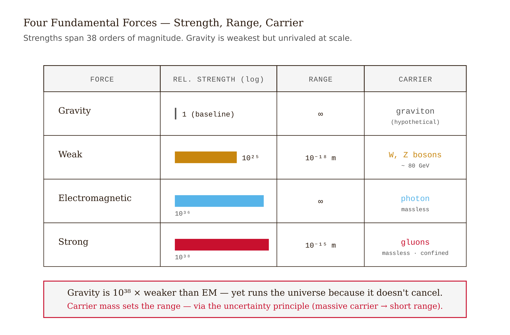
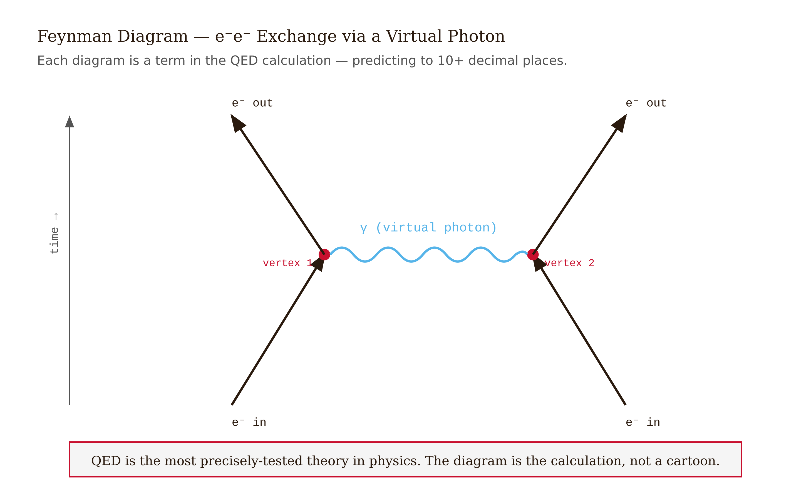
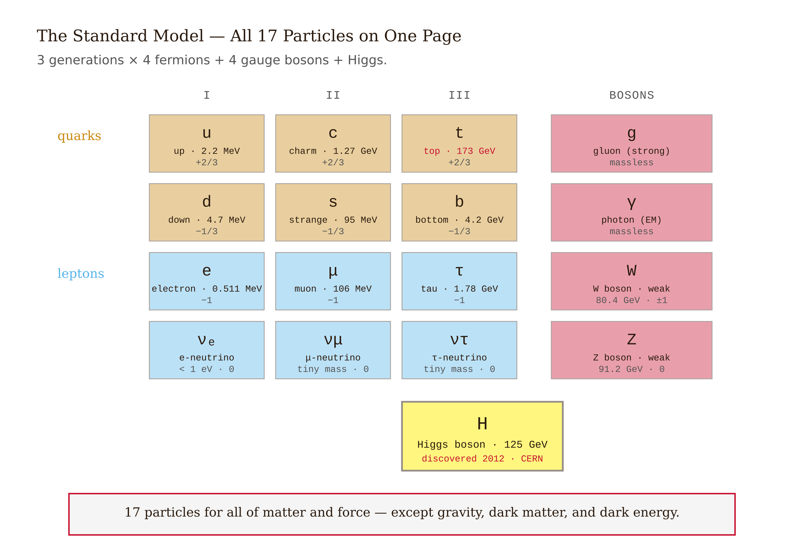
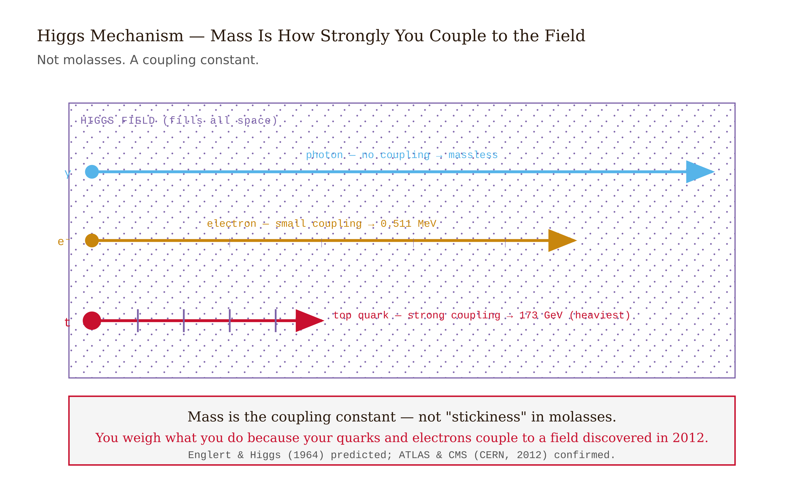
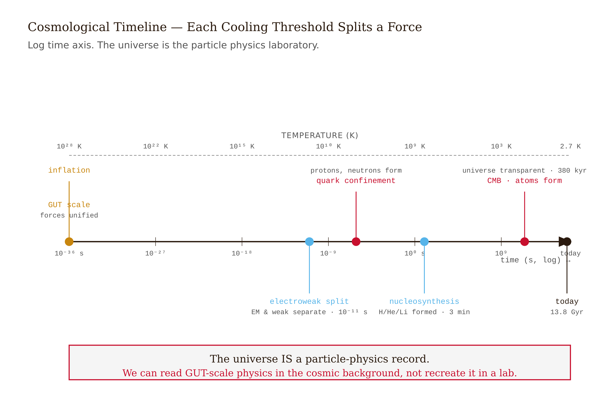
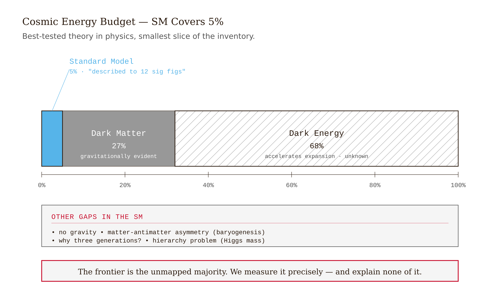

# Chapter 6 — Particle Physics: Reading the Deepest Structure of Matter


## TL;DR

- This chapter gives a working overview of Particle Physics: Reading the Deepest Structure of Matter, focusing on the ideas a reader needs before moving to the next chapter.
- The chapter moves through Forces Are Carried by Particles, What Matter Is Made Of, The Higgs Field and the Origin of Mass, Forces Were Once One, and related ideas.
- Read it for the main argument, the vocabulary it introduces, and the practical judgment it asks you to develop.

---

Pick up a magnet. Hold it near an iron nail and feel the pull. Now consider that you are holding the entire mass of the Earth in competition with that magnet — all the rock, all the iron core, all the water and atmosphere, every gram of it — pulling the nail downward through gravity. The magnet wins.

This is not a curiosity. It is a measurement. The electromagnetic force, at the atomic scale, is approximately $10^{38}$ times stronger than gravity. That is a 1 followed by 38 zeros. The two forces are not in the same league. They are not in the same sport.

And yet gravity is the force you notice. It governs the planets, shapes the galaxies, dominates your experience of the physical world. How can the weaker force be so apparent and the stronger one so easy to forget?

The answer is that the electromagnetic force nearly cancels itself out. Matter is almost exactly electrically neutral — every negative electron paired with a positive proton. The attractions and repulsions balance to almost nothing, and only the tiny residuals drive chemistry. Gravity has no such cancellation. Every mass attracts every other mass, with nothing to neutralize it. Gravity wins at large scales not because it is strong, but because it accumulates.

This disparity — $10^{38}$ in strength, yet gravity running the universe at large scales — is the first thing particle physics has to teach. The forces you experience are not what they appear to be at the deepest level. What they actually are, at that level, is one of the most remarkable discoveries in the history of science.

---

## Forces Are Carried by Particles

For a long time, the question of how one object influences another across empty space was simply left unanswered. Newton knew it bothered him. He called gravity an "action at a distance" and refused to speculate on the mechanism, writing that he would "frame no hypotheses" about how the force was transmitted.

The quantum mechanical answer, developed in the twentieth century, is that forces are transmitted by particles. This is not a vague metaphor. It is a precise, calculable description. Two electrons repel each other because they exchange photons. One electron emits a photon; the other absorbs it; the exchange of momentum produces what we measure as repulsion. The photon here is not a photon you could detect with a sensor — it exists for too short a time, borrowing energy from the vacuum in a way the uncertainty principle permits. It is called a virtual photon, meaning it is a real feature of the field but not an observable particle in the usual sense.

Richard Feynman developed a way to draw these exchanges — the diagrams that now bear his name. Time runs upward; two particles approach from below; a carrier particle passes between them; they recoil. The diagram is not just a picture; it is a term in a calculation. You can compute the probability of the interaction by summing over all possible diagrams, and the answers match experiment to extraordinary precision. Quantum electrodynamics — the theory of light and electrons — is the most accurately tested theory in physics, correct to more than ten decimal places.

The principle extends to all four forces. Each has its own carrier particle, and the properties of the carrier determine the properties of the force.

The photon carries electromagnetism. It is massless, uncharged, and travels at $c$. Because it is massless, it can travel any distance without losing energy. The electromagnetic force has infinite range: it weakens with distance as $1/r^2$, but it never reaches zero. The light from distant galaxies is carried by photons that have traveled for billions of years.

The W and Z bosons carry the weak nuclear force. They are massive — the W boson is about 80 times the mass of a proton. Mass matters here in a deep way: by Heisenberg's uncertainty principle, a massive particle cannot exist for long before it must be reabsorbed. The more massive the carrier, the shorter its reach. The weak force operates only over distances smaller than $10^{-18}$ meters, far smaller than an atomic nucleus. This is why we call it weak — not because it is intrinsically feeble, but because its range is so short that ordinary matter almost never encounters it. When two particles are actually close enough, the weak force is comparable in strength to electromagnetism.

Gluons carry the strong nuclear force. There are eight types of gluons, carrying a property called color charge — a label, not an actual color — that comes in three varieties: red, green, and blue. Gluons bind quarks into protons and neutrons, and they do it with a force that has a strange property: unlike gravity or electromagnetism, it does not weaken as the quarks pull apart. It stays roughly constant, like a spring that never goes slack. Try to pull a quark out of a proton and you pour in so much energy that a new quark-antiquark pair is created. Free quarks never escape. The strong force is confined.

Gravity has its presumed carrier too — the graviton — but no one has detected it directly. Every other prediction of the gravitational field theory is confirmed; the graviton simply requires sensitivity far beyond anything we can build. LIGO detects gravitational waves, which are ripples in the gravitational field, but the individual gravitons that would correspond to those waves are not separable at any energy we can reach.

---

## What Matter Is Made Of

By the early 1960s, particle accelerators had produced enough new particles to fill a zoo. Dozens of them: pions, kaons, lambdas, sigmas, omegas — each with its own mass, charge, and lifetime. There was no obvious pattern. The periodic table had at least been organized by chemistry and atomic number. This particle zoo had no organizing principle.

Murray Gell-Mann and George Zweig, working independently in 1963, proposed the solution: all of these particles were composites, made of smaller entities called quarks. Three quarks — up, down, and strange — were enough to explain the entire zoo. A proton is two up quarks and one down quark. A neutron is one up and two down. A pion is a quark bound to an antiquark. All the particles in the zoo were just different arrangements of the same small set of building blocks.

There was an immediate problem. Up quarks carry charge $+\frac{2}{3}$, and down quarks carry charge $-\frac{1}{3}$. These are fractions of the elementary charge — and no isolated particle with fractional charge had ever been observed. Electrons have charge $-1$. Protons have charge $+1$. Every observed particle has integer charge. Why would the fundamental building blocks have fractional charges?

The answer is confinement. Quarks are never found alone. They combine only in arrangements that produce integer total charge: three quarks summing to 0 or ±1, or a quark-antiquark pair summing to 0 or ±1. The rules of the strong force are such that only color-neutral combinations — combinations where the color charges cancel, red plus green plus blue equaling white — are stable. Any attempt to remove a quark just creates new quark-antiquark pairs from the energy of separation.

Direct evidence of quarks came in 1967 at Stanford. Physicists accelerated electrons to very high energies and fired them at protons. High-energy electrons are probes: their wavelength, by de Broglie's formula, is small enough to resolve objects far smaller than a proton. What the scattering patterns showed was that the proton was not a smooth sphere of charge. Inside it were three point-like objects, each carrying a fraction of the proton's charge. These were quarks.

Three more quark types were subsequently discovered: charm in 1974, bottom in 1976, top in 1995. The top quark is the heaviest fundamental particle known, with a mass larger than a gold atom. It required the most powerful accelerators built to that point just to produce it.

Alongside the quarks sit the leptons. These are particles that do not feel the strong force at all. The electron is the lightest lepton, stable and permanent, the foundation of chemistry and electronics. The muon is a heavier copy of the electron — identical in every property except mass, and unstable, decaying in about two microseconds. The tau is heavier still. Each charged lepton has a corresponding neutrino: near-massless, uncharged, interacting only through the weak force. Neutrinos pass through matter almost without effect. Every second, roughly 100 billion solar neutrinos pass through every square centimeter of your body. You do not notice.

The complete inventory has a pattern. There are three generations, each a copy of the first at higher mass:

First generation: up quark, down quark, electron, electron neutrino. This is all ordinary matter.

Second generation: charm quark, strange quark, muon, muon neutrino. Heavier, unstable, produced only in high-energy collisions.

Third generation: top quark, bottom quark, tau, tau neutrino. Heavier still.

Add the carrier particles — the photon, the W and Z bosons, the gluons — and one more particle, the Higgs boson, and you have the Standard Model: seventeen fundamental particles (plus their antiparticles) that account for all known matter and all forces except gravity.

This is a short list. Seventeen particles for everything. Every star, every molecule, every cell, every stone.

---

## The Higgs Field and the Origin of Mass

In the early formulation of the Standard Model, there was a mathematical problem. The theory required the W and Z bosons to be massless, as mathematical consistency demanded. But experiment had shown they were massive — enormously so. The theory and reality disagreed.

Peter Higgs, François Englert, and others resolved this in 1964 by proposing a field that permeates all of space: the Higgs field. Particles acquire mass by interacting with this field as they move through it. The stronger the coupling between a particle and the Higgs field, the greater the mass. The top quark couples strongly; it is heavy. The photon does not couple at all; it is massless. The electron couples weakly; it is light.

The Higgs field has its own carrier particle — the Higgs boson — just as the electromagnetic field has the photon. Finding this particle was the central goal of the Large Hadron Collider, the 27-kilometer circular accelerator buried beneath the French-Swiss border.

On July 4, 2012, the ATLAS and CMS collaborations — teams of several thousand physicists each — announced the discovery of a new particle with mass around 125 GeV. By 2013, after analyzing more collisions, CERN confirmed it was the Higgs boson. Higgs and Englert received the Nobel Prize that year.

The implications are not merely technical. The Higgs field does not just explain why the W and Z bosons are massive. It explains mass itself, as a property conferred by the interaction between a particle and a universal field that fills all of space. Your mass, and the mass of everything you have ever touched, comes from this interaction. The Higgs is not an exotic particle relevant only to accelerator physicists. It is, in a precise sense, what makes matter matter.

---

## Forces Were Once One

Physicists are compelled by a deep instinct toward unity. When two apparently separate phenomena turn out to be the same thing in different guises, it feels like progress — like stripping away appearance to reach reality.

The first great unification in modern physics came in the nineteenth century, when Maxwell showed that electricity and magnetism were two aspects of a single electromagnetic field. In the 1960s, Glashow, Salam, and Weinberg showed that electromagnetism and the weak force are similarly unified at high energies. Below about 100 GeV, the forces look different: electromagnetism has infinite range, the weak force almost none. Above 100 GeV, they become indistinguishable — the W and Z bosons behave like massless particles, the forces equalize. The difference at low energy is an artifact of the Higgs field: below a certain energy, the field breaks the symmetry between them.

This electroweak unification was confirmed in the 1980s at CERN, when the W and Z bosons were discovered with exactly the masses the theory predicted, to better than one percent. The unification is not a hypothesis; it is measured fact.

The natural question follows: do the strong force and the electroweak force unify at even higher energies? Grand unified theories — GUTs — propose that they do, at around $10^{14}$ GeV. No accelerator can approach this energy, and none will in any foreseeable future. But GUTs make testable predictions at lower energies, and one of them is this: the proton should decay.

Protons are, in ordinary experience, completely stable. Every hydrogen atom that existed when the Sun formed is still a hydrogen atom today, 4.5 billion years later. But GUTs say that a proton is not absolutely stable — just extraordinarily long-lived. The predicted lifetime is around $10^{31}$ years, a number so large it makes the age of the universe seem brief.

Yet the prediction is testable. If one proton in $10^{31}$ decays per year, then a tank of $10^{31}$ protons will show one decay per year on average. The Super-Kamiokande detector in Japan — a cylindrical tank of 50,000 tons of ultra-pure water, surrounded by photomultiplier tubes, buried a kilometer underground to shield it from cosmic rays — contains roughly that many protons. It has been watching since the 1990s. No proton decay has been observed. This places the proton's lifetime above $5.9 \times 10^{33}$ years, which rules out the simplest GUTs and constrains the more complex ones.

The absence of a signal is still a measurement. It tells us which models of unification are wrong.

---

## The Early Universe as Evidence

There is another way to probe physics at extreme energies, and it has been available all along: cosmology.

The universe began in a state of extreme density and temperature. As it expanded, it cooled. At each cooling threshold, physics changed — new symmetries were broken, new forces became distinct. The history of the universe is a record of particle physics at energies we can never recreate in a laboratory.

At times earlier than about $10^{-11}$ seconds after the Big Bang, the temperature was high enough that the electromagnetic and weak forces were unified. The W and Z bosons moved as freely as photons; the distinction between them was meaningless. At around $10^{-11}$ seconds, the universe cooled below the electroweak transition: the Higgs field settled into its current state, the W and Z bosons acquired mass, and the two forces became distinct.

Earlier still — before $10^{-36}$ seconds — energies were high enough for the strong force to unify with the electroweak force, if GUTs are correct. Something happened at this epoch that may have driven cosmic inflation: an extraordinarily rapid expansion of space, expanding the observable universe from a region smaller than a proton to something macroscopic in a fraction of a second. Inflation explains why the universe is so nearly uniform on large scales, why the cosmic microwave background — the light left over from when atoms first formed, 380,000 years after the Big Bang — shows temperature fluctuations of only one part in 100,000. Without inflation, a universe starting in a hot, dense state would not be expected to be so smooth.

Inflation is not confirmed in the same sense that electroweak unification is confirmed. It is the leading explanation for the observations, with strong indirect support but no direct test. Gravitational waves from the inflationary epoch would leave a distinctive imprint on the polarization of the cosmic microwave background, and experiments are searching for this signal now.

The story from $10^{-6}$ seconds onward is well-established. Quarks bound into protons and neutrons. Protons and neutrons fused, during the first three minutes, into the light nuclei: hydrogen, helium, and trace amounts of lithium. The ratios in which these formed are precisely predicted by the Standard Model, and precisely observed in the oldest, most pristine gas clouds in the universe. This is one of the great quantitative successes of physics: a theory of what happened in the first three minutes of the universe, confirmed by measurement billions of years later.

---

## What the Standard Model Does Not Explain

The Standard Model is one of the most thoroughly tested physical theories ever constructed. Its predictions have been confirmed, in some cases, to twelve significant figures. The discovery of the Higgs boson completed its particle content. By any measure, it works.

It also has large, obvious gaps.

It does not include gravity. The graviton, if it exists, does not fit naturally into the Standard Model's framework. Attempts to quantize gravity in the way the other forces are quantized produce infinities that cannot be removed. This is not a minor technical problem; it is a fundamental incompatibility between general relativity and quantum mechanics. Resolving it is the central unsolved problem of theoretical physics.

It does not explain dark matter. Astronomical observations — the rotation curves of galaxies, the bending of light around galaxy clusters, the pattern of fluctuations in the cosmic microwave background — all point to the existence of matter that interacts gravitationally but not electromagnetically. It does not emit, absorb, or reflect light. It makes up about 27 percent of the total energy content of the universe. Nothing in the Standard Model accounts for it.

It does not explain dark energy — the observed acceleration of the universe's expansion, which requires a form of energy with negative pressure that makes up about 68 percent of the total. The Standard Model, at its best, predicts a vacuum energy that is $10^{120}$ times larger than the observed dark energy. This is the largest discrepancy between a theory and observation in all of physics.

It does not explain why there are three generations of particles. The second and third generations are exact copies of the first, at higher mass. There is no principle in the Standard Model that requires this, or that forbids a fourth generation, or that explains why the masses are what they are. The pattern exists, and we do not know why.

And it does not fully explain matter itself. When the universe formed in the Big Bang, matter and antimatter should have been created in equal quantities. Equal quantities annihilate completely. But the universe contains matter — you are matter, the Earth is matter, the stars are matter. Somewhere in the early universe, a slight asymmetry arose: slightly more matter than antimatter, perhaps one extra matter particle per billion matter-antimatter pairs. The antimatter annihilated; the residual matter is everything we see. The Standard Model predicts such an asymmetry, but not large enough to account for the observed universe. There is physics beyond the Standard Model that we have not yet found.

These are not minor loose ends. They are large, open questions about most of the universe's content. The Standard Model describes with extraordinary precision the 5 percent of the universe that is ordinary matter. The other 95 percent remains, at the level of particle physics, essentially unknown.

---

## The Frontier

The magnet and the nail. The force that built the universe's large-scale structure against the force that built the atoms inside you — separated by $10^{38}$, both described by the exchange of carrier particles, both part of a structure that was once unified in the first fractions of a second after the Big Bang.

What particle physics has achieved is a complete description of ordinary matter at its most fundamental level. Quarks and leptons and their carriers — the seventeen particles of the Standard Model — are the alphabet from which everything you can see and touch is written. The precision of the theory is extraordinary. The gaps in the theory are also extraordinary.

The history of physics has a pattern: every time we think we have reached the bottom, there is another layer. Atoms were thought fundamental; they contain nuclei. Nuclei were thought fundamental; they contain quarks. Quarks, for now, appear point-like at the smallest scales we can probe — but we have thought that before.

The frontier is where the map ends. Every gap in the Standard Model is a pointer toward it: dark matter, dark energy, the missing antimatter, the hierarchy of masses, the three generations, gravity. These are not failures of the theory. They are its edges. And in physics, the edges are where the new physics lives.

---

## LLM Exercise — Chapter 6: Particle Physics

**Project:** Physics Demonstrations Notebook — final probe and integration.
**What you're building this chapter:** the cloud-chamber demo (if doable) OR a real-data cosmic-ray investigation, plus the project's final integration — compiling all demos into a "Physics Demonstrations Notebook" deliverable with photos, observations, and analysis.
**Tool:** **Claude Project** + **Cowork** for final compilation.

---

**The Prompt:**

```
Chapter 23 — the closing chapter — of my Physics Demos Notebook.
Chapter 23 taught: the Standard Model (quarks, leptons, gauge
bosons); the four fundamental forces (gravity, EM, weak, strong);
unification (electroweak, GUT, quantum gravity as open questions);
the limits of the Standard Model (no graviton, no dark matter
explanation, no dark energy explanation).

Particle physics happens at scales WAY below household sensors.
Two paths for the demo.

Demo A — Cloud Chamber (the dramatic option)

Materials:
- A clear plastic container (a fish tank or large pickle jar).
- Isopropyl alcohol (90%+).
- A piece of black felt or sponge.
- Dry ice (~5 lbs from a grocery store; safety: handle with
  thick gloves; never inside a closed container).
- A bright LED flashlight.
- A flat metal plate or cookie sheet.

Procedure (do outdoors or in well-ventilated space):
1. Cut the felt to fit the bottom of the container.
2. Soak the felt in isopropyl alcohol.
3. Cool the metal plate by placing it on dry ice (~30 min).
4. Place the container inverted on the cooled plate (felt side up).
5. The alcohol vapor saturates inside; the cold bottom super-
   saturates the vapor.
6. In a darkened room, shine the flashlight horizontally through
   the container.
7. Wait 5-10 minutes. You should see thin VAPOR TRAILS — these
   are the tracks of cosmic-ray muons and other particles
   traveling through the chamber. Each track is a particle whose
   path was made visible by alcohol condensation.

This is one of physics's most direct evidences of subatomic
particles existing — you can SEE their tracks.

Demo B — Cosmic-Ray Data Investigation

If a cloud chamber isn't practical:
- Visit the CMS or ATLAS public event displays online.
- Look at real recorded events from the LHC.
- For each event, identify the particles produced (Standard
  Model particles).
- Compute the rough mass-energy of one event using E = pc for
  high-energy particles.

Public sources: CERN Open Data Portal, MIT's MasterClass,
Particle Adventure (CPEPweb).

The Project's Closer

After Demo A or B, compile the full Physics Demos Notebook.

1. Review all demos. List each with one sentence on what it
   demonstrated and one observation that surprised you.

2. Identify the THREE demos that produced the most counterintuitive
   findings — the ones where the textbook's prediction differed
   most strikingly from your initial guess.

3. Identify the THREE demos that didn't quite work the first time
   and what you changed to make them work. (This is your
   experimental-physics-skills development log.)

4. Write the Notebook Master Document, 1,500-2,000 words:
   - Foreword: what the project taught you that the chapters
     alone wouldn't have.
   - Selected highlights with photos.
   - The "what didn't work and what I fixed" section.
   - The "what surprised me most" section.
   - One specific physical phenomenon you understand better now
     than you did at the start of the semester.

End with a 200-word Forward — what physics demos you'd want
to do next semester (in advanced mechanics, EM, quantum) if you
continue. The project is honest only if you name what you
haven't yet built.
```

---

**What this produces:** A particle-physics demo (cloud chamber or data investigation) + the compiled Notebook Master Document — a 1,500-2,000 word essay on what the demos taught the student. The compiled notebook with photos becomes a real portfolio piece.

**How to adapt this prompt:**

- *For your own project:* Demo A (cloud chamber) is dramatic but requires dry ice. Demo B (real LHC data) requires nothing but internet access and is also dramatic in its way.
- *For ChatGPT / Gemini:* Works as written.
- *For Claude Code:* For the cloud-chamber timelapse video processing or for analyzing event-display images, Claude Code is useful.
- *For a Claude Project / Cowork:* The compilation step pulls all entries into one document. Cowork can read all the entries and assemble them.

**Connection to previous chapters:** Every prior demo feeds the master document. The cloud chamber/cosmic-ray demo specifically connects to the quantum world — the tracks you see are particles with quantized properties.

**Preview of next chapter:** There is no next chapter — this is the close. What's next is the compiled Notebook itself: a real piece of experimental work with all demos done, photographed, and analyzed. Most physics graduates have never produced something like this. You have.

---

##  AI Wayback Machine
**Chien-Shiung Wu** designed the 1956 experiment that disproved parity conservation — opening modern particle physics.

**Run this:**

```
Who is Chien-Shiung Wu, and how does their work connect to particle physics we covered in this chapter? Keep it to three paragraphs. End with the single most surprising thing about their career or ideas.
```

→ Search **"Chien-Shiung Wu"** on Wikipedia.

**Now make the prompt better.** Try one of these:

- Ask it to walk through one of Chien-Shiung Wu's experiments or arguments in detail.
- Add a constraint: "Answer including criticisms or limits of Chien-Shiung Wu's framework."

What changes? What gets better? What gets worse?

*Figure 6.1 — Four Fundamental Forces*


*Figure 6.2 — Feynman Diagram*


*Figure 6.3 — The Standard Model*


*Figure 6.4 — Higgs Mechanism*


*Figure 6.5 — Cosmological Timeline*


*Figure 6.6 — Standard Model Accounts for 5 Percent of the Universe*

