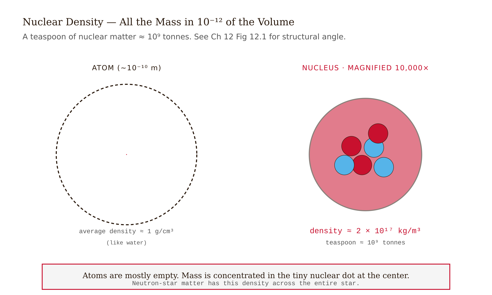
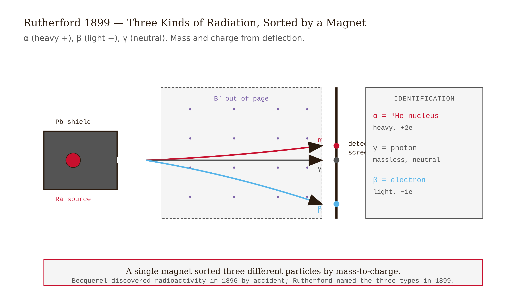
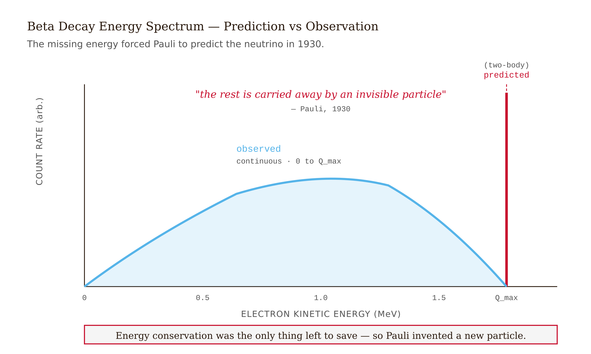
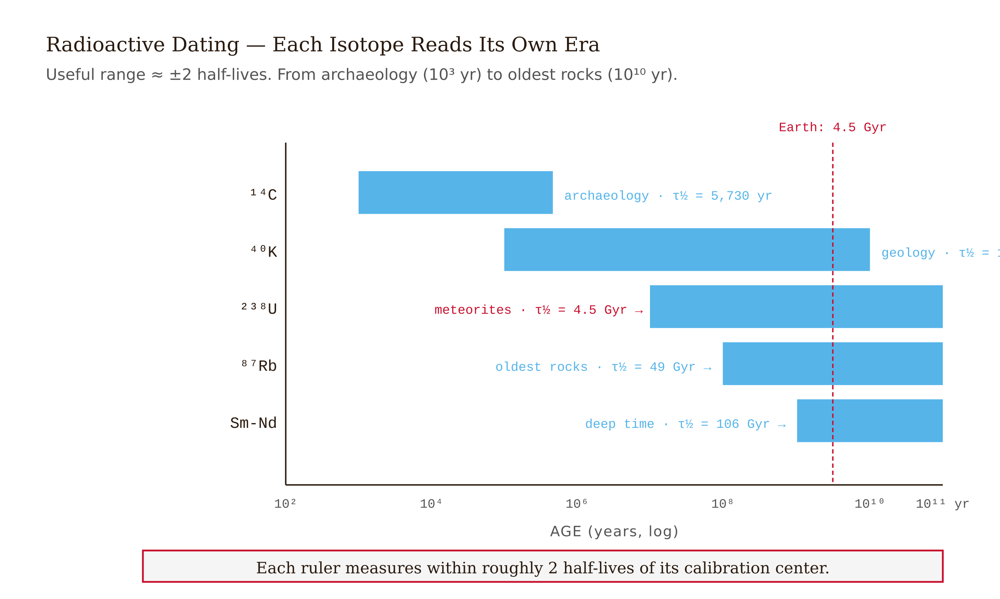
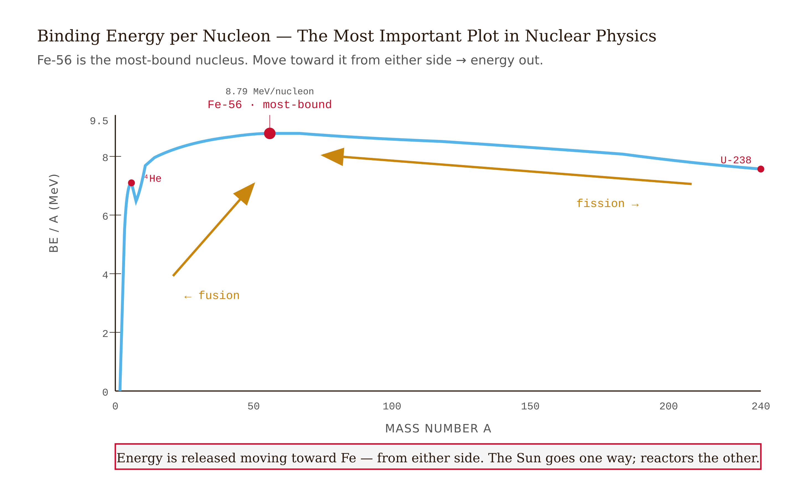
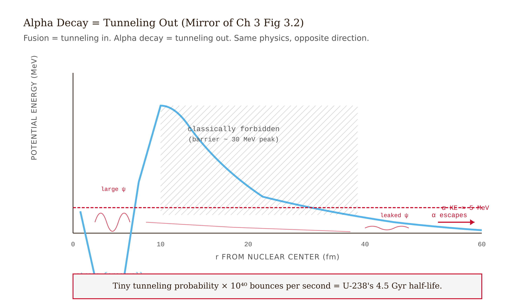
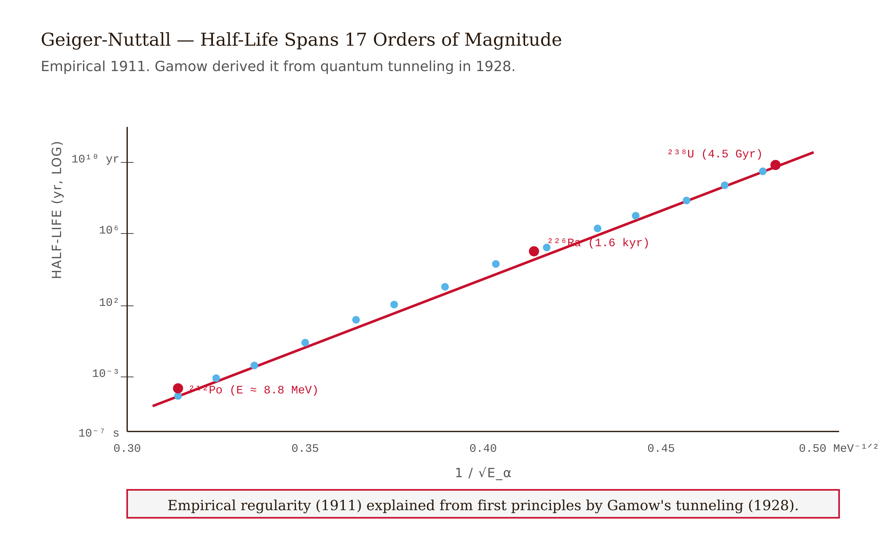

# Chapter 13 — Radioactivity and Nuclear Physics

## TL;DR

- Why the energy stored in nuclei is a million times greater than the energy stored in atoms — and what happens when it gets out.
- The chapter moves through What's Inside a Nucleus, Three Kinds of Disintegration, The Decay Law, Where the Energy Comes From: Mass Defect, and related ideas.
- Read it for the main argument, the vocabulary it introduces, and the practical judgment it asks you to develop.

*Why the energy stored in nuclei is a million times greater than the energy stored in atoms — and what happens when it gets out.*

Marie Curie's notebooks from the 1890s are stored in lead-lined boxes at the Bibliothèque Nationale de France. Visitors who wish to consult them must sign a liability waiver. They will remain dangerously radioactive for another fifteen hundred years.

This is not a figure of speech. The notebooks contain trace contamination from the materials Curie handled in her converted shed at the École Supérieure de Physique et de Chimie — polonium and radium that she and Pierre isolated from tonnes of pitchblende ore through months of brutal chemical processing, with no ventilation and no protective equipment. She died in 1934 of aplastic anemia, almost certainly caused by her decades of exposure. Pierre was killed in 1906 by a horse-drawn cart before the radiation could finish him. The notebooks carry the physical record of their work, and also, invisibly, the thing that killed her.

What killed her — what makes those notebooks dangerous — has nothing to do with chemistry. Chemical reactions, even violent ones, involve energies measured in electron volts per atom: a few eV for a combustion reaction, a fraction of an eV for an ionic bond. What Curie was handling releases energies of millions of electron volts per nucleus. The radiation she was absorbing, day after day, was not the product of electrons rearranging themselves between atoms. It was the product of nuclei flying apart. A different layer of matter entirely, with a different energy scale, a different set of forces, and a different set of rules.

This chapter is about that layer.

---

## What's Inside a Nucleus

The nucleus of an atom contains protons and neutrons — collectively called nucleons. The proton carries charge $+e$ and mass 1.0073 u. The neutron carries no charge and mass 1.0087 u. The number of protons, $Z$, determines the element. The total number of nucleons, $A = Z + N$ where $N$ is the neutron number, determines the isotope.

Carbon-12 has 6 protons and 6 neutrons: $A = 12$. Carbon-14 has 6 protons and 8 neutrons: $A = 14$. Same element, different isotopes. Both are carbon chemically; one is radioactive, one is not.

The nucleus is small. Radii scale as $r \approx (1.2 \text{ fm}) A^{1/3}$, where a femtometer ($10^{-15}$ m) is about one hundred-thousandth the radius of the atom. A typical nucleus is roughly $10^{-14}$ m across. The density of nuclear matter — all isotopes, roughly the same — is about $2 \times 10^{17}$ kg per cubic meter. A teaspoon of nuclear material would weigh roughly a billion tonnes.


*Figure 13.1 — Nuclear scale comparison *

Protons are positively charged. Pack six or eighty of them into a volume the size of a nucleus, and the electrostatic repulsion is enormous. Something must hold them together. That something is the strong nuclear force: a short-range attractive interaction between nucleons that is vastly stronger than electromagnetism at distances of a femtometer or so, and effectively zero beyond a few femtometers. It is attractive between any two nucleons — proton-proton, neutron-neutron, proton-neutron. Without it, every nucleus larger than hydrogen would immediately explode.

---

## Three Kinds of Disintegration

Ernest Rutherford, working in Montreal in 1899, took a sample of radium and put it next to a magnetic field. The mysterious radiation it emitted bent into three separate beams — two in opposite directions, one straight through. Three types of radiation, distinguished by charge and mass.

He named them alpha, beta, and gamma.


*Figure 13.2 — Rutherford's 1899 magnetic deflection experiment *

**Alpha radiation** is helium-4 nuclei: two protons and two neutrons, charge $+2e$, mass 4 u. When a nucleus emits an alpha, it loses 2 protons and 2 neutrons. Uranium-238 alpha-decays to thorium-234:

$$^{238}_{92}\text{U} \to {^{234}_{90} \text{Th}} + {^4_2 \text{He}}$$

Check conservation: mass number $238 = 234 + 4$, charge $92 = 90 + 2$. Both balanced. The energy released — the Q-value — comes from the mass difference:

$$Q = [m(^{238}\text{U}) - m(^{234}\text{Th}) - m(^4\text{He})] c^2 \approx 4.27 \text{ MeV}$$

That is about a million times the energy released in a typical chemical reaction.

**Beta radiation** comes in two varieties, both involving the conversion of one type of nucleon to another.

In beta-minus decay, a neutron converts to a proton, emitting an electron and an antineutrino:

$$n \to p + e^- + \bar{\nu}_e$$

The nucleus gains one proton, loses one neutron; mass number stays the same. Carbon-14 decays this way to nitrogen-14 — the reaction that makes radioactive dating possible.

In beta-plus decay, a proton converts to a neutron, emitting a positron and a neutrino:

$$p \to n + e^+ + \nu_e$$

One less proton, one more neutron; mass number unchanged. This is the reaction that powers PET scanners.

The electron in beta-minus decay was not sitting inside the nucleus before the decay. It did not exist. A neutron was converted and an electron was created. This is the first place students encounter particle creation — the idea that particles can be made from energy, not just rearranged. It is real, and it is why Enrico Fermi's 1934 theory of beta decay required the new concept of the weak nuclear force.

The neutrino in beta decay puzzled physicists for years. When beta particles were first measured, they came out with a continuous spectrum of energies — not the single definite energy expected from a two-body decay. Wolfgang Pauli, in 1930, proposed in a letter (which he addressed to "Dear Radioactive Ladies and Gentlemen") that an unobserved third particle must be carrying away the missing energy. He called it the neutrino — the little neutral one. It took 26 years to detect it experimentally. Pauli was right.


*Figure 13.3 — Beta decay energy spectrum *

**Gamma radiation** is photons — extremely high-energy photons, in the MeV range. Gamma emission occurs when a nucleus in an excited state drops to its ground state, releasing the energy difference as light. No protons or neutrons change; only the nuclear energy state.

These are not fundamentally different phenomena. They are the same principle — an unstable quantum system losing energy and settling toward a lower state — expressed through three different physical mechanisms.

---

## The Decay Law

Individual nuclei decay at random. You cannot predict when any particular nucleus will disintegrate. What you can predict is the rate at which a large population decays.

Each nucleus has the same probability of decaying per unit time, $\lambda$, called the decay constant. This is a fixed property of the isotope — not affected by temperature, chemical environment, pressure, or how old the nucleus is. If you have $N$ nuclei, the rate of decay is $\lambda N$. As time passes:

$$\frac{dN}{dt} = -\lambda N$$

$$N(t) = N_0 e^{-\lambda t}$$

After one half-life $t_{1/2} = \ln 2 / \lambda \approx 0.693/\lambda$, half the original nuclei remain. After two half-lives, one quarter. After ten half-lives, about one-thousandth. The exponential is relentless.

Half-lives span an extraordinary range. Some nuclear excited states live for $10^{-23}$ seconds — the time it takes light to cross the nucleus. Tellurium-128 has a half-life of about $2 \times 10^{24}$ years — $10^{14}$ times the age of the universe. This range of forty-six orders of magnitude is one of the most remarkable facts in physics, and it falls out naturally from quantum tunneling, which we will get to.

The practical application of the decay law is dating. In 1949, Willard Libby worked out that living organisms maintain a constant ratio of carbon-14 to carbon-12 because cosmic rays constantly replenish atmospheric C-14 via the reaction $n + {^{14}\text{N}} \to {^{14}\text{C}} + p$. The steady-state atmospheric ratio is about one C-14 atom per trillion C-12 atoms. When an organism dies, no new carbon enters. The C-14 decays with a half-life of 5,730 years. Measure the current C-14/C-12 ratio, compare to the atmospheric value, and the decay equation gives the time since death.

In 1988, three independent laboratories — Tucson, Oxford, Zürich — received small swatches of cloth from the Shroud of Turin. Each measured the C-14/C-12 ratio by accelerator mass spectrometry. The three labs agreed: the cloth dated to 1260–1390 AD with 95% confidence. The carbon-14 clock had spoken. The physics community considers the matter settled.

For older material — rocks, not cloth — carbon-14 cannot reach. Its half-life of 5,730 years limits it to roughly 50,000 years. Potassium-40, with a half-life of 1.25 billion years, covers geological time. Uranium-238, with a half-life of 4.5 billion years, covers the age of the solar system. Clair Patterson used uranium-lead isotope ratios in meteorites to measure the age of the Earth as $4.55 \pm 0.07$ billion years in 1956 — one of the most precise and consequential measurements in the history of science.


*Figure 13.4 — Radioactive dating clocks and their ranges *

---

## Where the Energy Comes From: Mass Defect

Here is a fact that surprises people the first time they encounter it. The mass of a nucleus is less than the sum of the masses of its constituent protons and neutrons.

Weigh a helium-4 atom: 4.00260 u. Now add up two proton masses and two neutron masses: $2(1.00794) + 2(1.00867) = 4.03322$ u. The sum is 4.03322. The atom is 4.00260. The difference is 0.03062 u. Where did that mass go?

It became binding energy. The strong nuclear force holds the nucleons together, and the bound system has less energy — and therefore less mass — than the free particles. This mass defect $\Delta m$ converts directly to binding energy via $E = mc^2$:

$$\text{BE} = \Delta m \cdot c^2 = 0.03062 \text{ u} \times 931.5 \text{ MeV/u} = 28.5 \text{ MeV}$$

For helium-4, that is about 7.1 MeV per nucleon.

Now compute it for iron-56: $Z = 26$, $N = 30$, atomic mass 55.9349 u. The sum of free nucleons is $26(1.00794) + 30(1.00867) = 56.4665$ u. The mass defect is $56.4665 - 55.9349 = 0.5316$ u. The binding energy is $0.5316 \times 931.5 = 495.2$ MeV. Per nucleon: $495.2 / 56 = 8.84$ MeV.


*Figure 13.5 — Binding energy per nucleon vs*

Plot binding energy per nucleon against mass number for every stable isotope. The curve rises steeply from hydrogen, peaks near iron and nickel at about 8.8 MeV per nucleon, then falls gradually out to uranium at about 7.6 MeV per nucleon. This curve is the most important graph in nuclear physics. It tells you everything about where nuclear energy comes from and why certain reactions release it.

Going up the curve — fusing light nuclei toward iron — releases energy. This is what stars do. Hydrogen fusing to helium, helium to carbon, carbon to oxygen, up to silicon and then iron. Each step up the binding-energy curve releases energy. Iron is the end: there is no further energy to be gained by continuing to fuse.

Going down from the right side of the curve — fissioning heavy nuclei like uranium toward iron — also releases energy. This is what nuclear reactors and bombs exploit. Uranium-235 fissions into two fragments nearer to iron, with more binding energy per nucleon, releasing about 200 MeV per fission. The same principle, the same curve, the same $E = mc^2$.

Stars stop burning at iron. Iron accumulates in the stellar core. When the core cannot burn further, gravity wins. The core collapses. The star explodes. Everything heavier than iron — gold, uranium, platinum — was made in those final seconds of stellar collapse, in neutron-capture reactions that could not proceed in the steady burning phase. The gold in any ring you own was synthesized in a supernova, or possibly in the collision of two neutron stars.

---

## Quantum Tunneling and Why Half-Lives Span 46 Orders of Magnitude

The alpha particles that fly out of radioactive nuclei present a puzzle.

Inside uranium-238, an alpha particle has kinetic energy of about 4 to 5 MeV. Outside the nucleus, the Coulomb repulsion from the remaining 90 protons of the daughter thorium nucleus creates a potential barrier of about 30 MeV at the nuclear surface. Classically, a 5 MeV particle cannot escape a 30 MeV barrier. Yet the alpha escapes, with measured kinetic energy of about 4.25 MeV, and uranium-238 has a half-life of 4.5 billion years.

George Gamow solved this in 1928 with quantum mechanics. The alpha is not a classical particle with a definite position. It is a quantum object with a wavefunction that extends through the classically forbidden region of the Coulomb barrier — exponentially decaying, but not zero. There is a small but nonzero probability that the alpha will be found on the outside of the barrier where classically it should never reach. Every time the alpha bounces around inside the nucleus, it has a tiny probability of tunneling out. Given enough bounces — and a nucleus provides something like $10^{21}$ bounces per second — eventually it escapes.


*Figure 13.6 — Quantum tunneling through the Coulomb barrier *

The tunneling probability depends exponentially on the barrier height and width. A slightly higher barrier means exponentially longer waiting time. This is why alpha-decay half-lives span 17 orders of magnitude while alpha-particle energies vary by only a factor of 2 or 3. A small change in energy means an exponential change in half-life. The Geiger-Nuttall law, discovered empirically in 1911 before quantum mechanics existed, encodes exactly this exponential sensitivity: $\log(t_{1/2})$ varies linearly with $1/\sqrt{E_\alpha}$.


*Figure 13.7 — Geiger-Nuttall plot *

Tunneling does not violate conservation of energy. The alpha has the same total energy on both sides of the barrier. What quantum mechanics allows is the possibility of finding the particle in a location that would be forbidden classically — not because energy is not conserved, but because the particle's position is not definite until measured.

---

## The Energy Scale That Changes Everything

Return to the question posed at the beginning. Why does nuclear physics kill people? Why can a few micrograms of polonium — the amount it takes to dissolve in a cup of tea — poison a person? Why are Curie's notebooks still radioactive a century after she last touched them?

The answer is the energy scale. Chemical processes involve electron-volt energies. Nuclear processes involve million-electron-volt energies. A single alpha particle from polonium-210 deposits 5.3 MeV in whatever tissue it strikes. Compare that to a visible-light photon: about 2 eV. The alpha carries roughly two and a half million times more energy than visible light, and it deposits that energy in a very short range — a few millimeters of tissue. At that energy density, chemical bonds break, DNA is damaged, cells die or mutate.

This same energy scale, controlled and harnessed, powers every nuclear reactor on Earth. Uranium-235 fissioning releases about 200 MeV per reaction. Coal combustion releases about 1 eV per molecule — roughly the C-O bond energy. Nuclear fuel releases about two hundred million times more energy per reaction than chemical fuel. This is not a small engineering advantage. It is the difference between a cubic centimeter of fuel and several thousand tonnes.

The physics is the same whether it heals, powers, or kills. A gamma ray that would be used in a medical procedure to destroy a tumor at therapeutic doses is the same gamma ray that causes radiation sickness at higher doses. The half-life that makes carbon-14 useful for dating artifacts over thousands of years is the same half-life that determines how long nuclear waste remains dangerous. Quantum tunneling that makes alpha decay possible is the same phenomenon that would, in principle, make a proton tunnel through a potential barrier — though the timescale is so long as to be unmeasurable.

Marie Curie understood none of this mechanism. She knew only that the material she was handling did something to photographic plates and ionized gases. She did not know it was also slowly destroying the cells of her bone marrow. The physics did not care. The energy scale of nuclei is what it is, independent of whether we understand it or respect it.

---

## LLM Exercise — Chapter 13: Radioactivity in Your Anchor Phenomenon

**Project:** Physics Reality Check Logbook
**What you're building this chapter:** A Logbook entry for nuclear physics. Most everyday phenomena involve no obvious radioactivity, but background radiation, GPS clock physics (Cs-137 and other isotopes), smoke detectors (Am-241), bananas (K-40), all touch nuclear physics. You can compute one quantitative property or write an "exception entry" identifying the nearest radioactive connection.
**Tool:** Claude Project.

### The Prompt

```
I'm continuing my Physics Reality Check Logbook for College Physics with LLMs.
My anchor phenomenon is [paste your 1-sentence description].

For Chapter 31, I want to think about radioactivity and nuclear physics. Most
everyday phenomena are not directly nuclear, but background radiation is
everywhere (cosmic rays, K-40 in bananas, radon from soil, terrestrial
gamma background).

Please:

1. Identify ONE nuclear or radioactivity aspect connected to my phenomenon.
Examples: for a bike commute — cosmic-ray muons hitting me (Chapter 28!),
terrestrial gamma background from soil, possible radon exposure in poorly
ventilated areas, Am-241 in any smoke detectors I pass. For a coffee maker —
K-40 in any banana I eat with my coffee (about 15 Bq per medium banana),
trace radium in some heating elements, cosmic-ray background. For a basketball
shot — K-40 in my own muscle tissue (~50 Bq/kg), cosmic-ray background.
For a marathon — additional cosmic-ray exposure from longer outdoor time,
possible commercial-flight exposure if I'm running a destination race.

2. Apply ONE chapter equation. Compute total radiation dose (multiply
activity × time × energy per decay × biological factor), or estimate decay
rate of a specific isotope at known concentration, or estimate half-life-
derived activity.

3. Specify input numbers (look up the isotope's half-life, decay energy, and
natural abundance).

4. Run the calculation. Report value with units.

5. One sanity check: does your computed dose agree with the typical natural-
background dose of ~0.1 μSv/hour at sea level?

6. One sentence connecting this to Chapter 32 (medical applications of
nuclear physics) — radiotherapy and medical imaging are next.

Save the output as logbook/chapter-31-radioactivity.md.
```

### What this produces

A Logbook entry connecting your phenomenon to natural radioactivity (which is everywhere) or to specific isotopes used in nearby technology.

### How to adapt this prompt

- *For phenomena indoors:* Radon is often the dominant exposure (especially in basements). Look up your local radon levels.
- *For phenomena involving travel:* Aircraft flight at 10 km altitude increases cosmic-ray dose by ~50×.
- *For ChatGPT/Gemini:* Identical with interface substitutions.

### Connection to previous chapters

Builds on Chapter 28 ($E = mc^2$ for binding energies) and Chapter 29 (quantum tunneling for alpha decay; photons for gamma rays).

### Preview of next chapter

Chapter 32 (medical applications of nuclear physics) shows how the principles of this chapter — specific isotopes, half-lives, decay modes — power X-ray imaging, CT scans, PET scans, MRI, radiotherapy, and radioisotope-based diagnostics.

---

##  AI Wayback Machine
**Chien-Shiung Wu** disproved parity conservation in 1956 — designing the experiment that showed nature distinguishes left from right at the nuclear level. The Nobel went to her theorist colleagues Lee and Yang; she was passed over.

**Run this:**

```
Who was Chien-Shiung Wu, and how does her parity-violation experiment connect
to the nuclear physics we covered in this chapter? Keep it to three paragraphs.
End with the single most surprising thing about her career or ideas.
```

→ Search **"Chien-Shiung Wu"** on Wikipedia.

**Now make the prompt better.** Try one of these:

- Ask it to walk through Wu's 1956 cobalt-60 experiment and what specifically violated parity.
- Ask it about Wu's role in the Manhattan Project and her later career at Columbia.

What changes? What gets better? What gets worse?
