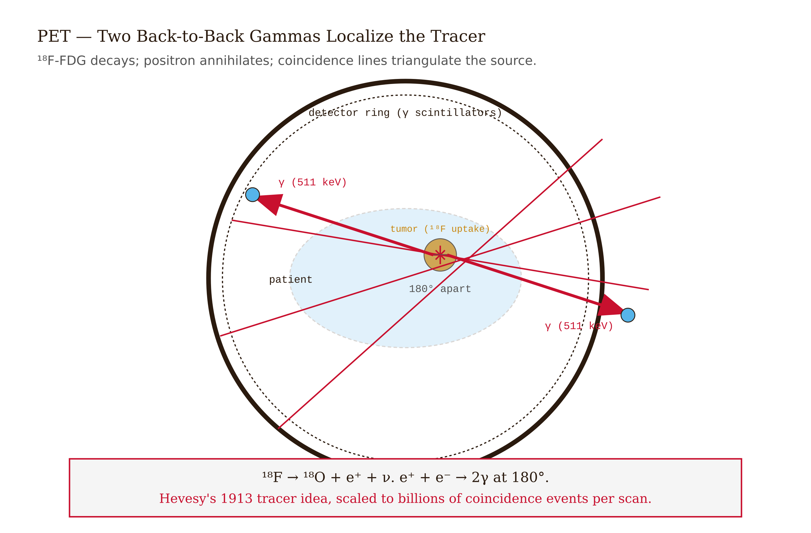
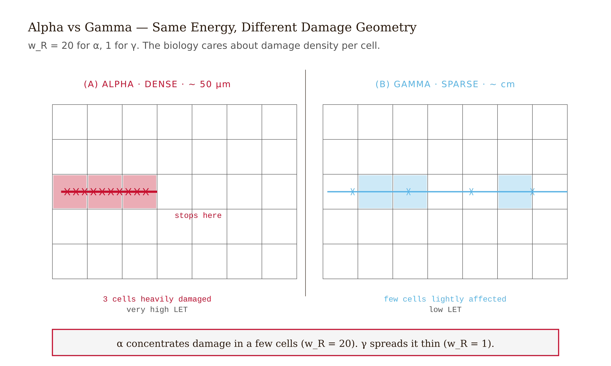
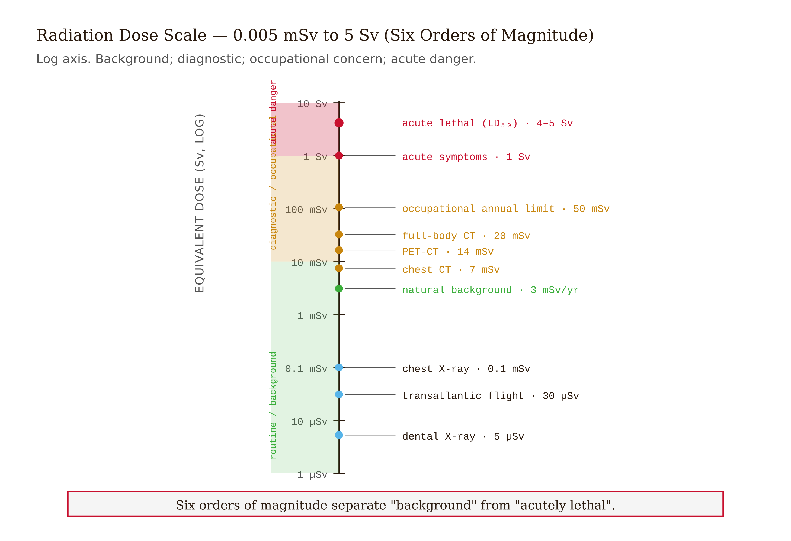
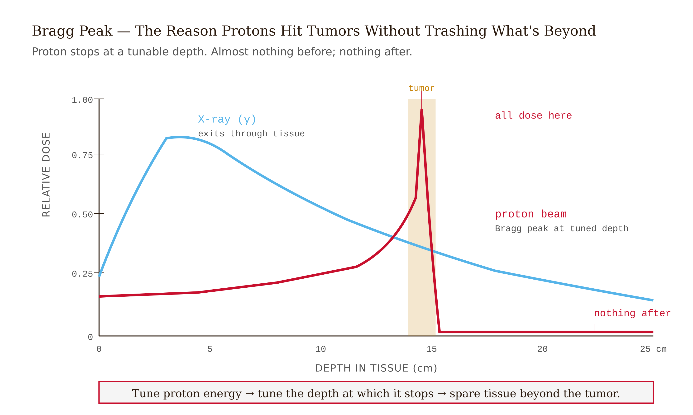

# Chapter 14 — Medical Applications of Nuclear Physics

## TL;DR

- How tracking a landlady's leftovers became the logic behind PET scans, bone scans, and cancer therapy.
- The chapter moves through Three different windows into the body, Counting the cost: what radiation dose actually means, Using the same physics to treat, The same dose, from diagnosis to therapy, and related ideas.
- Read it for the main argument, the vocabulary it introduces, and the practical judgment it asks you to develop.

*How tracking a landlady's leftovers became the logic behind PET scans, bone scans, and cancer therapy.*

In 1913, George de Hevesy was a twenty-eight-year-old postdoctoral chemist in Vienna with a problem. He suspected his landlady was serving him the same leftover meat on Wednesday that he had left on his plate the previous Sunday, recycled through the hash. He had no proof. He did, however, have access to radium-D — what we now call lead-210, a beta emitter with a half-life long enough to be useful. He sprinkled a small quantity onto his portion one Sunday evening, left the rest of the dish behind, and waited.

On Wednesday, she served hash. He brought out an electroscope. It discharged. The radium-D was in the new dish.

The landlady was caught. But sitting at that table in 1913, de Hevesy realized he had demonstrated something that would eventually reshape medicine. A radioactive isotope behaves chemically like its stable partners. It follows the same biological pathways. But wherever it goes, a radiation detector can find it. Tag a substance with a radioactive atom, and you can track that substance through any chemical or biological process you like — including the living human body.

That idea, applied for the next century, produced PET scans, bone scans, thyroid therapy, targeted cancer treatment, and an entire field called nuclear medicine. This chapter is about how the nuclear physics of Chapter 13 — alpha, beta, gamma, half-life, binding energy — gets put to work.

---

## Three different windows into the body

Start with the problem: you need to know what is happening inside a patient, without cutting them open. You have several tools. Which one you reach for depends on what question you're actually asking, and the different tools detect entirely different physical signals.

A chest X-ray is a shadow. External X-rays from a tube pass through the body and are differentially absorbed depending on what they encounter. Bone — high atomic number, high density — absorbs a lot. Soft tissue absorbs less. Air absorbs almost nothing. The transmitted intensity is recorded on film or a detector behind the patient. What you get is a two-dimensional projection of a three-dimensional density distribution. It shows you structure: broken bones, fluid in the lungs, enlarged lymph nodes, foreign objects. What it cannot show you is what those structures are doing.

CT (computed tomography) is the same physics taken further. Instead of one projection angle, you take hundreds of angles as the X-ray tube rotates around the patient, and a computer reconstructs the three-dimensional density field from those projections. The spatial resolution is excellent — sub-millimeter. The dose is meaningful: a chest CT delivers roughly 7 mSv, which we'll come back to.

Now consider a bone scan. The patient is injected with technetium-99m bound to a bone-seeking compound. The technetium concentrates in regions of active bone metabolism — fracture sites, tumor invasion, infection. A few hours later, the patient lies under a gamma camera, a large flat detector that records the arrival position of each gamma ray. The image shows where the tracer went, and therefore where metabolic activity is high. You cannot learn from a bone scan whether a femur is in one piece. You can learn that there's a hot spot of unusual activity in the femur, suggestive of a metastasis, that the X-ray shows as apparently normal bone.

The gamma camera is detecting function, not structure.

Now consider PET. The patient is injected with $^{18}$F-FDG — fluorodeoxyglucose, a glucose analog with a fluorine-18 atom attached. Cells that consume glucose preferentially (cancer cells, active brain regions) accumulate the FDG. The fluorine-18 decays by positron emission. The positron travels a few millimeters before annihilating with an electron, releasing two 511-keV gamma rays traveling in exactly opposite directions. A ring of detectors around the patient records coincident pairs — two gammas arriving simultaneously on opposite sides — and uses each pair to define a line on which the annihilation occurred. Reconstruct enough lines and you have a three-dimensional map of glucose consumption.


*Figure 14.1 — PET coincidence detection *

Three techniques. The X-ray shows density. The bone scan shows metabolic activity at bone. The PET scan shows glucose consumption anywhere in the body. The three are not interchangeable and do not compete. They answer different questions.

| modality | physical signal detected | what it reveals (structure vs |
| --- | --- | --- |
| chest X-ray, CT, MRI, gamma camera | SPECT, PET. | A concrete checkpoint for applying the chapter concept. |

Why is $^{99m}$Tc so nearly universal for scintigraphy? Because it is almost perfectly engineered for medical imaging. Its half-life is 6 hours — long enough for the tracer to distribute to the target tissue and be imaged, short enough to decay quickly so the patient's radiation dose stays low. Its 140-keV gamma is energetic enough to escape the body efficiently but not so energetic that it is hard to detect. And it can be chemically attached to dozens of different carrier molecules — bone-seekers, kidney tracers, heart-function tracers — so the same isotope serves many purposes. It is produced on site from $^{99}$Mo generators, which hospitals order weekly. The whole system is elegant in a way that looks designed but is really the accumulated result of decades of trial and selection.

The choice of $^{18}$F for PET comes from a different logic. Fluorine-18 decays by positron emission, which is what produces the coincident gamma pairs. Its half-life of 110 minutes is short enough to keep doses manageable but long enough to survive the synthesis, quality-control testing, and transport from the cyclotron where it is produced to the patient. The FDG molecule fools cells into taking up the tracer the way they take up glucose, but they cannot metabolize it further, so it accumulates. Cancer cells are metabolically hyperactive — they consume far more glucose than normal cells — and so the FDG concentrates in them, producing a signal that is often the first evidence of metastatic disease.

This is, in its essentials, still Hevesy's 1913 idea. Tag a biologically active molecule. Follow it with a radiation detector. The biology shows you what is happening; the radiation tells you where.

---

## Counting the cost: what radiation dose actually means

When a radiation beam or a radioactive substance deposits energy in tissue, the energy goes into ionizing atoms and breaking chemical bonds. The primary target of concern is DNA — double-strand breaks that, if not repaired correctly, can produce mutations and eventually cancer. The question is: how much energy, deposited in what form, carries what risk?

Three units come into play, and conflating them is the single most common confusion in this subject.

*Activity* is how many decays per second occur in a sample. One becquerel (Bq) is one decay per second. The curie (Ci), an older unit still in use clinically, is $3.7 \times 10^{10}$ Bq — the activity of one gram of radium-226. A diagnostic PET scan delivers about 10 mCi of $^{18}$F-FDG, or $3.7 \times 10^8$ decays per second.

*Absorbed dose* is energy deposited per unit mass of tissue. One gray (Gy) is one joule per kilogram. The older unit, the rad, is 0.01 Gy. Activity alone tells you nothing about dose — you need to know the energy of each decay and how much of it is deposited in the tissue of interest. Some radiation escapes the body without depositing; some deposits efficiently.

*Equivalent dose* is where biology enters. Equal absorbed doses from different radiation types are not equally dangerous. Alpha particles, being heavy and slow at comparable kinetic energies, deposit their energy in dense, short tracks — a few tens of micrometers in tissue. Within that short track, every DNA molecule is hit. Double-strand breaks cluster together and are difficult for the cell to repair. Gamma rays and beta particles deposit energy sparsely, in isolated ionizations that the cell's repair machinery can handle one by one. The *radiation weighting factor* $w_R$ captures this: for gammas and betas, $w_R = 1$; for alphas, $w_R = 20$. Equivalent dose in sieverts (Sv) is absorbed dose in Gy multiplied by $w_R$.

So: 0.5 Gy of gamma radiation is 0.5 Sv. The same absorbed dose from alphas is 10 Sv — twenty times more biologically damaging, because of how the energy is deposited, not how much.


*Figure 14.2 — Alpha vs*

This is why inhaled radon daughters — which are alpha emitters that lodge in the lung — are the second-leading cause of lung cancer in the United States after smoking. The alpha particles deposit their entire energy within a few cells of where they stop. The lung tissue adjacent to a radon daughter gets an extremely high local dose from what is, in joules, a tiny amount of energy.

Some reference numbers are worth knowing. Annual natural background in the United States averages about 3 mSv, dominated by radon ($\sim$2 mSv) and cosmic rays ($\sim$0.3 mSv, more at altitude). A chest X-ray is about 0.1 mSv. A chest CT is about 7 mSv. A whole-body PET-CT is about 14 mSv. The acute lethal dose — the dose at which half the exposed population dies within 30 days without medical care — is around 4-5 Sv.

That last number is worth pausing on. It is four to five *sieverts*, not millisieverts. The diagnostic doses we're discussing — 1 to 15 mSv — are three orders of magnitude below the acute lethal range. The cancer risk from a single CT scan, estimated using the linear no-threshold model, is on the order of 0.05% — compared to a baseline lifetime cancer risk of about 40%. For a patient with a suspected pulmonary embolism or a ruptured appendix, the 7-mSv CT that diagnoses the problem and enables treatment is an overwhelming net benefit. The question of whether repeated CT scans in lower-stakes situations are justified is a real question, but the arithmetic makes individual diagnostic scans unambiguously reasonable.


*Figure 14.3 — Radiation dose scale *

The linear no-threshold (LNT) model — the assumption that cancer risk scales linearly with dose all the way to zero — is used because it is conservative, not because it is proven. Below about 100 mSv, the epidemiological data are too noisy to distinguish a linear effect from zero effect. The Hiroshima and Nagasaki survivor data are clear above 100 mSv and become equivocal below. Regulatory practice in medicine and nuclear industries uses LNT because it errs on the side of caution; whether it accurately describes the actual biology at low doses is genuinely uncertain. Some evidence suggests a threshold below which normal DNA repair handles the damage; some evidence suggests a linear effect. The debate has not been resolved, and anyone who tells you it has is overstating the evidence in one direction or the other.

---

## Using the same physics to treat

Everything so far has been about *detection* — using radiation to reveal what is happening inside the body. But the same physical interaction — ionizing radiation depositing energy in cells and damaging DNA — can be used in the opposite direction: to kill cells you want dead. The challenge is selectivity. You want to kill the tumor. You do not want to kill the surrounding tissue.

The difference between diagnostic and therapeutic doses is about six orders of magnitude. A bone scan delivers a few millisieverts. A prostate-cancer radiation course delivers 80 Gy to the prostate — 80 joules per kilogram, focused to an organ the size of a walnut. The whole-body acute lethal dose is 4-5 Sv. The prostate receives 80,000 mSv. The patient survives because the dose is geometrically concentrated in one small volume.

This is the fundamental engineering problem of radiation therapy: deliver enough dose to kill the tumor while limiting the dose to everything else. The ratio of tumor kill to normal-tissue kill is called the *therapeutic ratio*, and every technique in radiotherapy exists to maximize it.

The classical approach is a linear accelerator (LINAC) producing 6-25 MV X-rays via bremsstrahlung. A high-energy beam enters the patient from one direction. The tumor is deep inside; normal tissue is in front of it. If you aim from only one angle, the tissue between the skin and the tumor absorbs the same dose as the tumor — or more, since X-ray beams deposit maximum dose near the surface and fall off with depth. The solution is to rotate the beam through many angles, so that the tumor — where all the beams cross — accumulates high dose, while no single piece of normal tissue is ever in the path of more than a fraction of the total beam fluence. Modern intensity-modulated radiation therapy (IMRT) uses computer-optimized beam shapes and intensities that produce dose distributions conforming to the tumor's irregular three-dimensional shape. The tumor gets 80 Gy; the rectum a centimeter away might get 30.

There is a deeper physical solution, and it involves the Bragg peak.

When a charged particle — a proton, for instance — moves through tissue, it loses energy continuously via ionizations, and the rate of energy loss increases as the particle slows. Fast protons lose energy slowly; slow protons lose energy quickly. Just before the proton stops, it deposits a sharp spike of energy — the Bragg peak — in a very short length of tissue. Beyond that point, the proton is gone and deposits nothing. Before that point, the proton was moving fast and deposited relatively little.

Compare this to the X-ray beam, which deposits maximum dose near the surface and decays exponentially with depth. To deliver 80 Gy to a deep prostate with X-rays, you must also deliver substantial dose to the bladder wall in front of it and the rectum behind it. With a proton beam tuned so that the Bragg peak falls exactly at the tumor depth, you can deposit most of the dose at the tumor, with much less in the tissue in front and almost nothing behind. For pediatric brain tumors, where the tissue behind the target is developing brain in a child, this physical advantage is decisive.


*Figure 14.4 — Bragg peak vs*

Proton therapy is expensive — the accelerator required costs on the order of $100 million, versus a few million for a LINAC — and its clinical advantage over advanced X-ray techniques is debated for many adult cancers. But the physics is unambiguous: the Bragg peak is a real and meaningful advantage where the geometry makes it relevant.

Beyond external beams, the same tracer logic used for diagnosis can be turned to therapy. Iodine-131 ($t_{1/2}$ = 8 days) emits both beta particles (for therapy) and gammas (for imaging). The thyroid gland concentrates iodine — it cannot distinguish the radioactive isotope from the stable isotope you get from food. A large dose of $^{131}$I injected into a thyroid-cancer patient finds its way to any remaining thyroid tissue, including metastatic deposits, and the beta particles (range ~1-2 mm in tissue) deliver a killing dose locally, while most of the gammas escape and cause little harm. Differentiated thyroid cancer treated with surgery plus $^{131}$I has a five-year survival rate above 95%.

Radium-223 for bone-metastatic prostate cancer works by a similar logic. Radium is a calcium analog — the body treats it like calcium and deposits it preferentially at sites of high bone turnover, which is exactly where prostate cancer metastases go. The alpha particles emitted by radium-223 (range ~$<100$ micrometers in tissue) kill the tumor cells in the bone lesion while causing minimal damage to surrounding bone marrow. Radium-223 is the first internal alpha emitter approved for cancer treatment, and the alpha's high $w_R$ (= 20) is, in this context, a therapeutic advantage rather than a hazard.

---

## The same dose, from diagnosis to therapy

Let me close by making the scale concrete. In a single patient with differentiated thyroid cancer, the same physical principle plays out across six orders of magnitude of dose.

Initial workup: a $^{99m}$Tc thyroid scan, perhaps 5-10 mCi, effective dose around 3-5 mSv. The tracer is chemically attached to a pertechnetate carrier that the thyroid takes up. The gamma camera images the distribution. The cancerous nodule shows up as an area of absent or altered uptake.

Staging: a $^{18}$F-FDG PET-CT, 10 mCi, effective dose around 14 mSv. The whole body is surveyed for metabolic hotspots that might be metastatic disease.

Treatment: the surgeon removes the thyroid. Then the patient receives $^{131}$I, typically 100-200 mCi — twenty times the activity of the PET scan. The dose to the thyroid bed and any residual thyroid tissue is measured in grays. The same gammas that were imaged at diagnostic doses now confirm uptake post-therapy. The same iodine-concentrating biology that made the original scan work now ensures the therapeutic dose goes exactly where it needs to go.

Three steps. Three doses separated by a factor of roughly thirty from bottom to top. One underlying principle throughout: a radioactive atom follows the same chemical pathways as its stable counterpart, and a radiation detector — or a radiation dose — can exploit that.

Hevesy proved this with an electroscope and a suspicious landlady in 1913. Modern nuclear medicine runs on the same idea at the scale of millions of procedures per year.

---

## Exercises

### Warm-up

**14.1** *(imaging modalities)* Match each modality to what it primarily reveals: (a) chest X-ray, (b) bone scan with $^{99m}$Tc, (c) PET with $^{18}$F-FDG, (d) MRI. Choose from: tissue density and structure; metabolic glucose consumption; active bone turnover; soft-tissue water content and relaxation environment.

**14.2** *(unit conversions)* Convert: (a) 10 mCi to becquerels, (b) 2.0 Gy to rad, (c) 15 mSv to rem, (d) 0.25 Gy of alpha radiation to sieverts (use $w_R = 20$).

**14.3** *(half-life choice)* Why is a 6-hour half-life nearly ideal for a diagnostic imaging tracer? What would go wrong with a half-life of 6 minutes? With 6 months?

**14.4** *(Bragg peak)* In one or two sentences, explain why a proton beam can be designed to deposit almost no dose in healthy tissue *beyond* a tumor, while a megavoltage X-ray beam cannot.

### Application

**14.5** *(dose comparison)* A patient receives a chest CT (7 mSv). (a) How many times the annual U.S. background dose (3 mSv) does this represent? (b) How does it compare to the acute radiation-sickness threshold (~1 Sv)? (c) How many chest X-rays (0.1 mSv each) deliver the same dose?

**14.6** *(equivalent dose)* A radiation worker's lung receives 0.10 Gy of absorbed dose from inhaled alpha-emitting radon daughters. (a) What is the equivalent dose in sieverts? (b) How does this compare to the annual U.S. occupational limit of 50 mSv?

**14.7** *(why $^{131}$I for thyroid)* Iodine-131 emits both beta particles and gamma rays. (a) Which emission is responsible for the therapeutic effect, and why? (b) Which emission allows post-treatment imaging to confirm uptake? (c) Why would an isotope that emits *only* alpha particles be problematic for this therapy?

**14.8** *(PET physics)* Fluorine-18 decays by positron emission. (a) What happens to the positron within a few millimeters? (b) What two photons are produced, and what are their energies and directions? (c) Why does PET require coincidence detection rather than single-photon detection?

### Synthesis

**14.9** *(LNT risk estimate)* Using the linear no-threshold model with a risk coefficient of $5 \times 10^{-5}$ per mSv, estimate the increased lifetime cancer risk from (a) a single chest CT (7 mSv), (b) ten CT scans over a lifetime (70 mSv total). Compare each to the U.S. baseline lifetime cancer risk of approximately 40%. What does this arithmetic imply about the risk-benefit calculation for a single medically indicated CT?

**14.10** *(diagnostic vs. therapeutic dose)* A typical $^{99m}$Tc bone scan delivers ~5 mSv. A therapeutic course of $^{131}$I for thyroid cancer delivers roughly 80 Gy to the thyroid bed. Convert 80 Gy to mSv (for beta/gamma, $w_R = 1$) and find the ratio of therapeutic to diagnostic dose. What does this ratio tell you about the meaning of "same physics, different purpose"?

**14.11** *(Gamma Knife geometry)* A Gamma Knife uses 192 separate $^{60}$Co sources, each producing a weak beam, all aimed at one point inside the brain. (a) Why use 192 sources instead of one strong source? (b) A single source delivers 1/192 of the total dose along its path before reaching the target. If the total target dose is 20 Gy, what does each source contribute to any single point along its entry path? (c) What property of $^{60}$Co (half-life 5.3 years, gamma energies 1.17 and 1.33 MeV) makes it suitable for this application?

### Challenge

**14.12** *(activity decay during imaging)* A patient is injected with 10 mCi of $^{18}$F-FDG ($t_{1/2}$ = 110 min) at time $t = 0$. The PET scan begins 60 minutes later and lasts 30 minutes. (a) What is the activity at the start of the scan? (b) What is the activity at the end of the scan? (c) Estimate the total number of decays during the 30-minute scan window. (d) If each decay deposits roughly 0.25 MeV in the patient's 70-kg body, estimate the absorbed dose in mGy from the scan window alone.

**14.13** *(proton vs. X-ray depth dose)* A proton beam is tuned so that its Bragg peak falls at a depth of 15 cm in tissue. A megavoltage X-ray beam deposits 100% of its maximum dose at 3 cm depth and falls off exponentially with attenuation coefficient $\mu \approx 0.05 \, \text{cm}^{-1}$. (a) What fraction of the X-ray beam's maximum dose reaches 15 cm depth? (b) If you need 70 Gy at the tumor (15 cm), what dose does the X-ray beam deposit at 3 cm (where maximum dose occurs)? (c) Explain in one sentence why the proton beam avoids this problem.

---

## LLM Exercise — Chapter 14: Medical Nuclear Physics in Your Anchor Phenomenon

**Project:** Physics Reality Check Logbook
**What you're building this chapter:** A Logbook entry for medical nuclear physics. Most everyday phenomena don't involve direct medical imaging, but you can compute the radiation dose from imaging procedures you've had, or from natural sources connected to your phenomenon, or from the imaging modalities used to diagnose conditions related to your phenomenon (e.g., a runner's stress-fracture scan).
**Tool:** Claude Project.

### The Prompt

```
I'm continuing my Physics Reality Check Logbook for College Physics
with LLMs. My anchor phenomenon is [paste your 1-sentence description].

For Chapter 14, I want to apply medical-nuclear-physics — imaging,
dose, therapy — to my phenomenon.

Please:

1. Identify ONE medical-nuclear connection to my phenomenon. Examples:
   for a bike commute — the X-ray that diagnoses a wrist fracture from
   a fall, the chiropractor's possible CT, the PET-CT a cyclist might
   get for cancer screening as an aging athlete. For a coffee maker —
   the cumulative dose from medical imaging over a typical adult
   lifetime, the X-rays the hospital uses to monitor an industrial
   coffee facility's machinery. For a basketball shot — the X-ray for
   any sports-related injury (knee, ankle, finger), the MRI for
   ligament damage. For a marathon — common runner's injuries imaged
   with X-ray or MRI (stress fractures, tendinitis), the DEXA scan for
   bone density monitoring of older runners.

2. Apply ONE chapter equation. Compute total dose from a specific
   imaging procedure (e.g., chest X-ray ~0.1 mSv, abdominal CT
   ~10 mSv), or compute equivalent dose from absorbed dose × w_R,
   or estimate cancer risk using the LNT model.

3. Specify input numbers (look up the typical effective dose for the
   procedure).

4. Run the calculation. Report value with units.

5. One sanity check: does the dose match published reference values?

6. One sentence connecting this to Chapter 15 (particle physics) —
   many of the same physics ideas (relativistic kinematics, charged
   particles in fields) underlie particle therapy.

Save the output as logbook/chapter-14-medical-nuclear.md.
```

### What this produces

A Logbook entry connecting your phenomenon to medical imaging or therapy via radiation dose.

### How to adapt this prompt

- *If you've had medical imaging procedures yourself:* The exercise becomes about computing your own cumulative dose, in millisieverts, with appropriate uncertainty.
- *For ChatGPT/Gemini:* Identical with interface substitutions.

### Connection to previous chapters

Builds on Chapter 13 (radioactivity, half-life, decay modes, $E = mc^2$) and Chapter 12 (X-ray production from atomic transitions).

### Preview of next chapter

Chapter 15 (particle physics) descends below the nucleon level — to quarks and the Standard Model. Many of the same physics ideas (relativistic energy-momentum, decay rates, conservation laws) reappear at the smaller scale.

---

##  AI Wayback Machine

**Run this:**

```
Who was Irène Joliot-Curie, and how does her work on artificial
radioactivity connect to the medical applications of nuclear physics
we covered in this chapter? Keep it to three paragraphs. End with
the single most surprising thing about her career or ideas.
```

→ Search **"Irène Joliot-Curie"** on Wikipedia.

**Now make the prompt better.** Try one of these:

- Ask it to walk through how Joliot-Curie's bombardment of aluminum with alpha particles produced the first artificial radioisotope.
- Ask it about her parallel work as a French government minister for scientific research.

What changes? What gets better? What gets worse?
